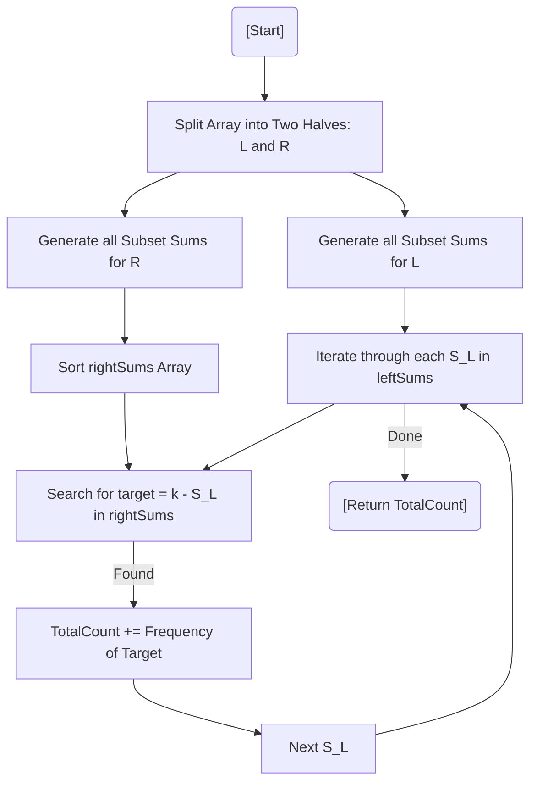

# 💡 Approach — Meet in the Middle

| 📄 [Problem](./Problem.md) | 💡 [Approach](./Approach.md) | 🧩 [Solution](./Solution.cpp) | 🚀 [Main](./Main.cpp) |
|:--------------------------:|:-----------------------------:|:------------------------------:|:---------------------:|

---

## 📊 Metadata

---

> [!TIP]
> **Core Insight:** When $N$ is up to $40$, $O(2^N)$ is too slow ($\approx 10^{12}$), but $O(2^{N/2})$ is feasible ($\approx 10^6$). Split the array into two halves, compute subset sums for both, and use binary search to "meet in the middle".

---

## 🔩 Step-by-Step Breakdown
1. **Divide and Conquer:** Split the input array of size $N$ into two halves: $L$ (size $N/2$) and $R$ (size $N - N/2$).
2. **Generate Sums:** Use recursion or bitmasking to generate all possible $2^{|L|}$ subset sums for the left half and $2^{|R|}$ for the right half.
3. **Sort for Efficiency:** Sort the `rightSums` array to enable fast searching.
4. **Binary Search Match:** For each sum $S_L$ in the `leftSums`, calculate the required target $T = k - S_L$. Use `std::equal_range` to find the frequency of $T$ in `rightSums`.
5. **Accumulate:** Add the frequency to the total count of valid subsets.

---

## 🔄 Mermaid Flowchart

---

## 📊 Complexity Analysis
| Type | Complexity |
| :--- | :--- |
| **Time Complexity** | $O(2^{N/2} \cdot \log(2^{N/2}))$ - Sorting and searching in the split space. |
| **Space Complexity** | $O(2^{N/2})$ - To store subset sums of both halves. |

---

> *"Divide and conquer, then search and unite — that's the secret to tackling the exponential."*

---

<h3>Happy Coding! 🚀</h3>

