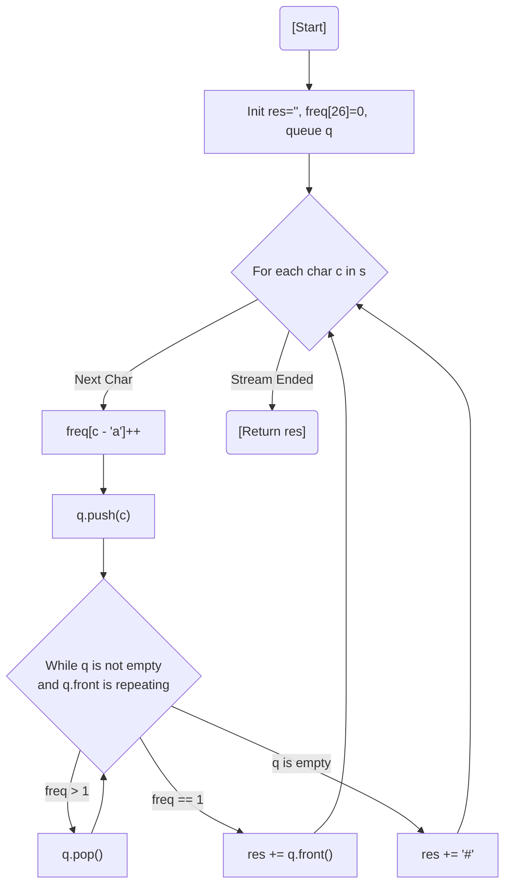

# 💡 Approach — First Non-repeating Character in a Stream

| 📄 [Problem](./Problem.md) | 💡 [Approach](./Approach.md) | 🧩 [Solution](./Solution.cpp) | 🚀 [Main](./Main.cpp) |
|:--------------------------:|:-----------------------------:|:------------------------------:|:---------------------:|

---

## 📊 Metadata

---

> [!TIP]
> **Core Insight:** A sliding stream requires a way to track the order of arrival and the frequency of occurrences. A **Queue** maintains the temporal order, while a **Frequency Array** (size 26) tracks counts. If the character at the front of the queue is no longer unique, pop it until a unique one is found.

---

## 🔩 Step-by-Step Breakdown
1. **Initialize Structures:** Create an empty `string` for the result, a `queue<char>` to store characters in arrival order, and a `freq[26]` array initialized to zero.
2. **Process the Stream:** Iterate through each character `c` in the input string `s`.
3. **Track Frequency:** Increment `freq[c - 'a']` and push `c` into the queue.
4. **Maintain Uniqueness:** While the queue is not empty, check the character at `q.front()`. If `freq[q.front() - 'a'] > 1`, it's a repeating character; pop it and repeat.
5. **Update Result:** 
   - If the queue is empty, append `'#'` (no non-repeating character found).
   - Otherwise, append `q.front()` (the first non-repeating character).

---

## 🔄 Mermaid Flowchart

---

## 📊 Complexity Analysis
| Type | Complexity |
| :--- | :--- |
| **Time Complexity** | $O(N)$ - Each character is pushed and popped at most once. |
| **Space Complexity** | $O(1)$ - The frequency array is size 26, and the queue contains at most 26 distinct characters at any time. |

---

> *"Keep only what is unique; the rest is just noise in the stream."*

---

<h3>Happy Coding! 🚀</h3>

