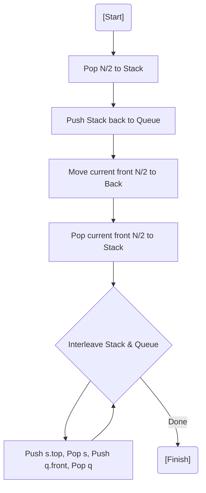

# 💡 Approach — Interleave First Half of the Queue with Second Half

| 📄 [Problem](./Problem.md) | 💡 [Approach](./Approach.md) | 🧩 [Solution](./Solution.cpp) | 🚀 [Main](./Main.cpp) |
|:--------------------------:|:-----------------------------:|:------------------------------:|:---------------------:|

---

## 📊 Metadata

---
> [!TIP]
> **Core Insight:** A queue's FIFO property can be manipulated using a stack's LIFO property. To interleave, we need the first half in a stack (temporarily reversed) and then repositioned so we can alternate between the stack top and the queue front.

---
## 🔩 Step-by-Step Breakdown
1. **Move First Half to Stack:** Pop $N/2$ elements from the queue and push them into an auxiliary stack.
2. **Reverse into Queue:** Enqueue stack elements back to the queue. (This puts the first half at the back, but reversed).
3. **Reposition Second Half:** Dequeue $N/2$ elements (the second half) and enqueue them back to the rear. Now the reversed first half is at the front.
4. **Prepare for Interleaving:** Pop $N/2$ elements (reversed first half) and push them back into the stack. Now the stack top is the original first element!
5. **Interleave:** Alternately pop from the stack (First Half) and the queue (Second Half), pushing each into the rear of the queue.

---
## 🔄 Mermaid Flowchart

---

## 📊 Complexity Analysis
| Type | Complexity |
| :--- | :--- |
| **Time Complexity** | $O(N)$ - Multiple passes over the halves. |
| **Space Complexity** | $O(N)$ - Auxiliary stack used for $N/2$ elements. |

---

> *"In the dance of data, interleaving is the art of perfect timing."*

---

<h3>Happy Coding! 🚀</h3>

