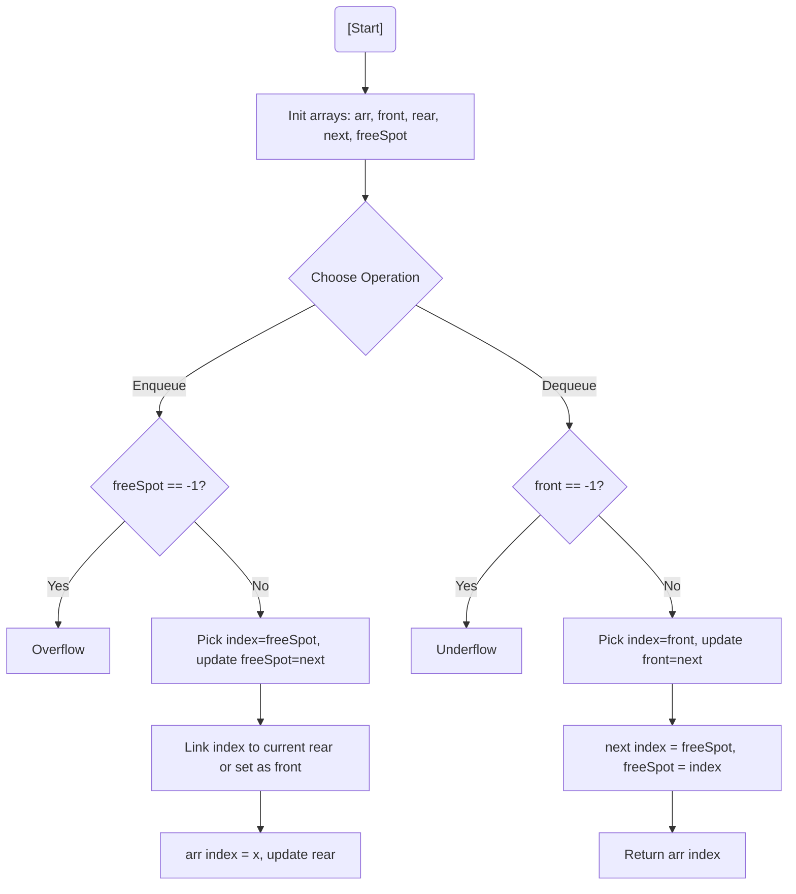

# 💡 Approach — N Queues in an Array

| 📄 [Problem](./Problem.md) | 💡 [Approach](./Approach.md) | 🧩 [Solution](./Solution.cpp) | 🚀 [Main](./Main.cpp) |
|:--------------------------:|:-----------------------------:|:------------------------------:|:---------------------:|

## 📊 Metadata

> [!TIP]
> **Core Insight:** To efficiently share space between $K$ queues in a single array of size $N$, treat the array as a pool of nodes. Use a **Linked List** approach where `next[]` stores either the next element in a queue or the next free slot in the array. This prevents "segment starvation" where one queue is full while others are empty.

## 🔩 Step-by-Step Breakdown
1. **Initialize Arrays:**
   - `arr[n]`: Stores actual data.
   - `front[k]`, `rear[k]`: Store front and rear indices for each queue (init to -1).
   - `next[n]`: Serves dual purposes (next element in queue OR next free slot).
   - `freeSpot`: Points to the first available index in `arr`.
2. **Enqueue Operation:**
   - Check if `freeSpot == -1` (Full).
   - Pick `index = freeSpot`, update `freeSpot = next[index]`.
   - If queue is empty, set `front[qi] = index`. Else, link current `rear[qi]` to `index` via `next`.
   - Set `next[index] = -1` and update `rear[qi] = index`.
3. **Dequeue Operation:**
   - Check if `front[qi] == -1` (Empty).
   - Get `index = front[qi]`.
   - Update `front[qi] = next[index]`.
   - Recycle the slot: Set `next[index] = freeSpot` and `freeSpot = index`.

## 🔄 Mermaid Flowchart

## 📊 Complexity Analysis
| Type | Complexity |
| :--- | :--- |
| **Time Complexity** | $O(1)$ for all operations (Enqueue, Dequeue, isEmpty, isFull). |
| **Space Complexity** | $O(N + K)$ to store auxiliary arrays. |

> *"Efficient space management is the difference between a functioning system and a collapsed one."*
---

<h3>Happy Coding! 🚀</h3>

