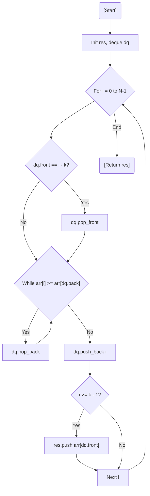

# 💡 Approach — Sliding Window Maximum using Deque

| 📄 [Problem](./Problem.md) | 💡 [Approach](./Approach.md) | 🧩 [Solution](./Solution.cpp) | 🚀 [Main](./Main.cpp) |
|:--------------------------:|:-----------------------------:|:------------------------------:|:---------------------:|

## 📊 Metadata

> [!TIP]
> **Core Insight:** To find the maximum in $O(1)$ during a sliding window, maintain a **Monotonic Deque** that stores indices of elements in decreasing order. When a new element comes, remove all smaller elements from the back of the deque because they can never be the maximum again.

## 🔩 Step-by-Step Breakdown
1. **Initialize Deque:** Create a `deque<int>` to store indices. The elements at these indices in `arr` will be maintained in descending order.
2. **Slide the Window:** Iterate through the array with index `i`.
3. **Remove Out-of-Range:** If `dq.front() == i - k`, the current maximum index is outside the window. Pop it from the front.
4. **Maintain Monotonicity:** While `dq` is not empty and `arr[i] >= arr[dq.back()]`, the elements at `dq.back()` are smaller and appear earlier than `arr[i]`. They are useless; pop them from the back.
5. **Push Current:** Add the current index `i` to the back of the deque.
6. **Capture Result:** Once the first window is formed ($i \ge k-1$), the index at `dq.front()` points to the maximum element of the current window.

## 🔄 Mermaid Flowchart

## 📊 Complexity Analysis
| Type | Complexity |
| :--- | :--- |
| **Time Complexity** | $O(N)$ - Each element is pushed and popped at most once. |
| **Space Complexity** | $O(K)$ - Deque stores at most $K$ indices. |

> *"In a sliding window, only the giants at the front truly matter."*
---

<h3>Happy Coding! 🚀</h3>

