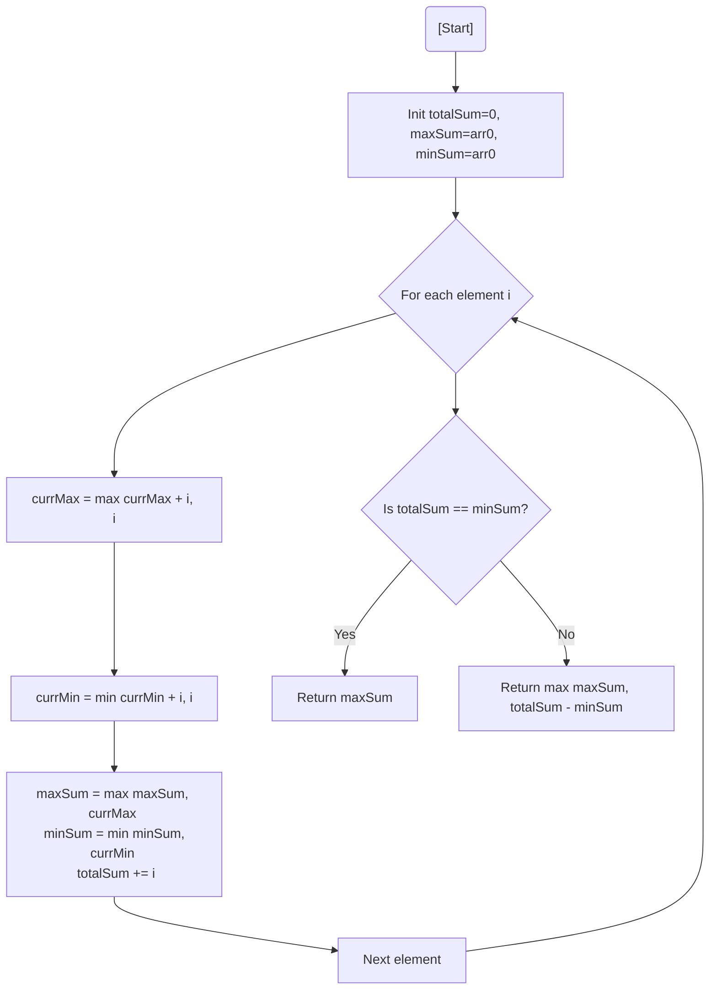

# 💡 Approach — Max Circular Subarray Sum

| 📄 [Problem](./Problem.md) | 💡 [Approach](./Approach.md) | 🧩 [Solution](./Solution.cpp) | 🚀 [Main](./Main.cpp) |
|:--------------------------:|:-----------------------------:|:------------------------------:|:---------------------:|

---

## 📊 Metadata

---

> [!TIP]
> **Core Insight:** The maximum circular subarray sum is either the maximum normal subarray sum (found by Kadane's) or the total sum minus the minimum normal subarray sum. If total sum equals min sum, it means all elements are negative, so return the max normal sum.

---

## 🔩 Step-by-Step Breakdown
1. **Normal Kadane's:** Calculate the maximum subarray sum (`maxSum`) using standard Kadane's Algorithm.
2. **Min Subarray Sum:** Simultaneously calculate the minimum subarray sum (`minSum`) using a modified Kadane's.
3. **Total Sum:** Calculate the sum of all elements in the array (`totalSum`).
4. **Wrap-Around Logic:** The potential circular maximum is `totalSum - minSum`.
5. **Handle Negative Edge Case:** If `totalSum == minSum` (all elements are negative), return `maxSum`. Otherwise, return `max(maxSum, totalSum - minSum)`.

---

## 🔄 Mermaid Flowchart

---

## 📊 Complexity Analysis
| Type | Complexity |
| :--- | :--- |
| **Time Complexity** | $O(N)$ - Single pass through the array. |
| **Space Complexity** | $O(1)$ - Constant space for sum variables. |

---

> *"Circular problems often require looking at what we've left behind to find what's truly ahead."*

---

<h3>Happy Coding! 🚀</h3>

