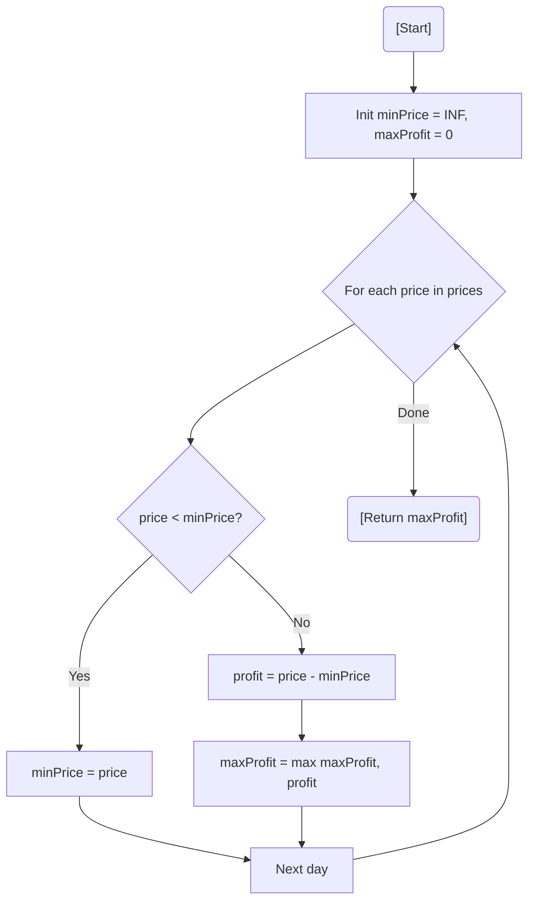

# 💡 Approach — Track Minimum Price

| 📄 [Problem](./Problem.md) | 💡 [Approach](./Approach.md) | 🧩 [Solution](./Solution.cpp) | 🚀 [Main](./Main.cpp) |
|:--------------------------:|:-----------------------------:|:------------------------------:|:---------------------:|

---

## 📊 Metadata

---

> [!TIP]
> **Core Insight:** To maximize profit with one transaction, you must buy at the lowest point seen *before* the current day. By tracking the `minPrice` as you iterate, you can calculate the potential profit at every step and keep the maximum.

---

## 🔩 Step-by-Step Breakdown
1. **Initialize:** Set `minPrice` to infinity and `maxProfit` to 0.
2. **Iterate:** Traverse the array of prices day by day.
3. **Update Buy Point:** If the current price is lower than `minPrice`, update `minPrice`. This represents the best potential day to buy so far.
4. **Calculate Sell Profit:** If the current price is higher than `minPrice`, calculate `price - minPrice`. This is the profit if we sell today.
5. **Global Maximum:** Update `maxProfit` if the current potential profit is higher than any previously recorded.

---

## 🔄 Mermaid Flowchart

---

## 📊 Complexity Analysis
| Type | Complexity |
| :--- | :--- |
| **Time Complexity** | $O(N)$ - Single pass through the prices array. |
| **Space Complexity** | $O(1)$ - Only two variables maintained. |

---

> *"The best time to buy was yesterday, but the second best time is when the price hits a new low."*

---

<h3>Happy Coding! 🚀</h3>

