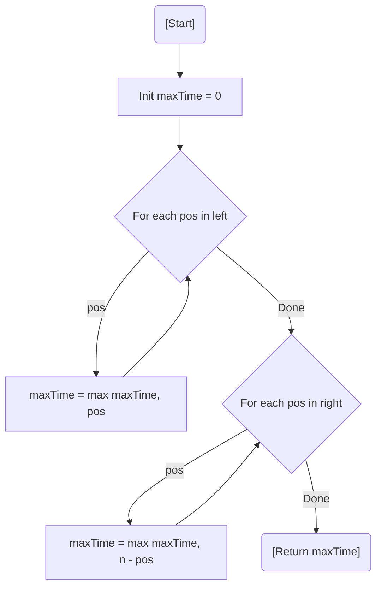

# 💡 Approach — Mathematical / Brainteaser

| 📄 [Problem](./Problem.md) | 💡 [Approach](./Approach.md) | 🧩 [Solution](./Solution.cpp) | 🚀 [Main](./Main.cpp) |
|:--------------------------:|:-----------------------------:|:------------------------------:|:---------------------:|

---

## 📊 Metadata

---

> [!TIP]
> **Core Insight:** When two identical ants meet and change directions, it is mathematically equivalent to them **passing through each other** without collision. Since all ants move at the same speed, we can ignore collisions and simply find the maximum time any single ant takes to reach its goal.

---

## 🔩 Step-by-Step Breakdown
1. **Ignore Collisions:** Treat every ant as if it walks straight to its destination regardless of other ants.
2. **Left-Moving Ants:** An ant at position `pos` moving left takes `pos` seconds to fall off at 0.
3. **Right-Moving Ants:** An ant at position `pos` moving right takes `n - pos` seconds to fall off at `n`.
4. **Max Time:** The total time is the `max()` of all individual times for all ants in the `left` and `right` arrays.

---

## 🔄 Mermaid Flowchart

---

## 📊 Complexity Analysis
| Type | Complexity |
| :--- | :--- |
| **Time Complexity** | $O(L + R)$ - Linear scan of both input arrays. |
| **Space Complexity** | $O(1)$ - Only one variable used for comparison. |

---

> *"Sometimes, the most complex collisions are just moments of passing through."*

---

<h3>Happy Coding! 🚀</h3>

