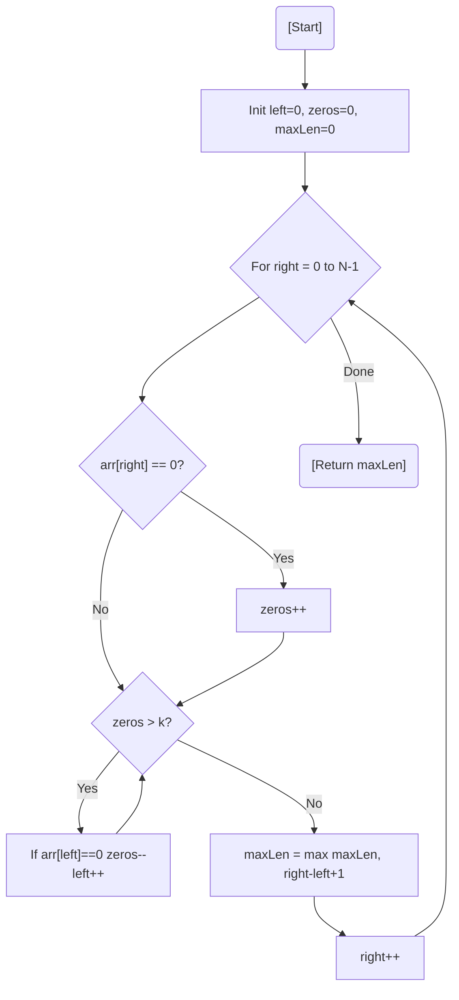

# 💡 Approach — Sliding Window / Two Pointers

| 📄 [Problem](./Problem.md) | 💡 [Approach](./Approach.md) | 🧩 [Solution](./Solution.cpp) | 🚀 [Main](./Main.cpp) |
|:--------------------------:|:-----------------------------:|:------------------------------:|:---------------------:|

---

## 📊 Metadata

---

> [!TIP]
> **Core Insight:** Maintaining a window `[left, right]` where the count of `0`s never exceeds `k` allows us to find the longest subarray of "effectively" consecutive `1`s in linear time. As `right` expands, `left` only moves forward when the window becomes invalid.

---

## 🔩 Step-by-Step Breakdown
1. **Initialize:** Start with `left = 0`, `zeros = 0`, and `maxLen = 0`.
2. **Expand:** Move the `right` pointer from `0` to $N-1$.
3. **Count Zeros:** If `arr[right] == 0`, increment the `zeros` count.
4. **Shrink:** While `zeros > k`, move the `left` pointer forward. If `arr[left]` was a `0`, decrement the `zeros` count before incrementing `left`.
5. **Update Max:** At each step, calculate the current window size `right - left + 1` and update `maxLen`.
6. **Return:** After the loop, `maxLen` holds the maximum consecutive `1`s.

---

## 🔄 Mermaid Flowchart

---

## 📊 Complexity Analysis
| Type | Complexity |
| :--- | :--- |
| **Time Complexity** | $O(N)$ - Each element is visited at most twice. |
| **Space Complexity** | $O(1)$ - No extra space used besides variables. |

---

> *"The window slides, the zeros flip, and the longest sequence emerges from the chaos."*

---

<h3>Happy Coding! 🚀</h3>

