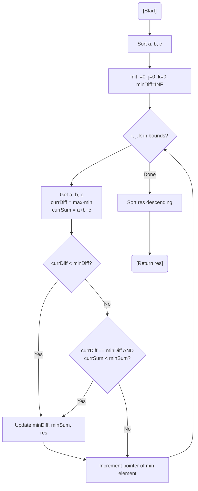

# 💡 Approach — Three Pointers on Sorted Arrays

| 📄 [Problem](./Problem.md) | 💡 [Approach](./Approach.md) | 🧩 [Solution](./Solution.cpp) | 🚀 [Main](./Main.cpp) |
|:--------------------------:|:-----------------------------:|:------------------------------:|:---------------------:|

---

## 📊 Metadata

---

> [!TIP]
> **Core Insight:** In three sorted arrays, the only way to potentially decrease the difference between the `max` and `min` element of a triplet is to increment the pointer pointing to the current **minimum**. Increasing the minimum reduces the gap, whereas increasing the maximum or middle value would only expand it.

---

## 🔩 Step-by-Step Breakdown
1. **Sort All:** Sort all three input arrays `a`, `b`, and `c` in ascending order.
2. **Pointers:** Initialize three pointers `i`, `j`, `k` at the start of each array.
3. **Loop:** Iterate while all pointers are within bounds.
4. **Range Check:**
   - Calculate `currDiff = max(a[i], b[j], c[k]) - min(a[i], b[j], c[k])`.
   - Update `minDiff` and the result triplet if `currDiff` is smaller.
   - If `currDiff == minDiff`, update only if the `sum` is smaller.
5. **Progress:** Increment the pointer that currently points to the minimum value among `a[i], b[j], c[k]`.
6. **Final Format:** Sort the final triplet in descending order before returning.

---

## 🔄 Mermaid Flowchart

---

## 📊 Complexity Analysis
| Type | Complexity |
| :--- | :--- |
| **Time Complexity** | $O(N \log N)$ - Dominated by sorting the arrays. |
| **Space Complexity** | $O(1)$ - Only constant extra space for pointers. |

---

> *"To close the gap, you must lift the floor, not raise the ceiling."*

---

<h3>Happy Coding! 🚀</h3>

