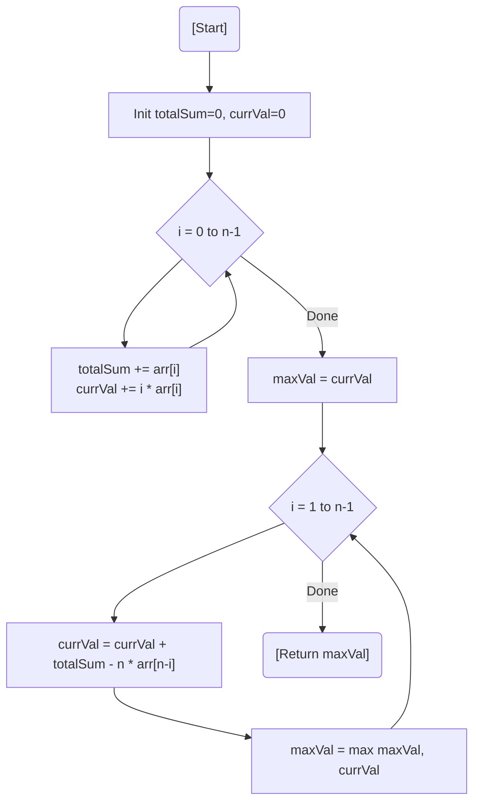

# 💡 Approach — Mathematics & Prefix Sum Logic

| 📄 [Problem](./Problem.md) | 💡 [Approach](./Approach.md) | 🧩 [Solution](./Solution.cpp) | 🚀 [Main](./Main.cpp) |
|:--------------------------:|:-----------------------------:|:------------------------------:|:---------------------:|

---

## 📊 Metadata

---

> [!TIP]
> **Core Insight:** Instead of recalculating the sum from scratch for every rotation ($O(N^2)$), we can derive the sum of a rotation from the previous one in $O(1)$.
> Formula: $S_{k} = S_{k-1} + \text{TotalSum} - n \times arr[n-k]$

---

## 🔩 Step-by-Step Breakdown
1. **Calculate Total Sum:** Find the sum of all elements in the array (`totalSum`).
2. **Initial Value:** Calculate the initial sum $S_0 = \sum_{i=0}^{n-1} (i \times arr[i])$.
3. **Iterate Rotations:** For each rotation $k$ from $1$ to $n-1$:
   - The element $arr[n-k]$ moves from the last position to the first.
   - Use the formula to update the current sum.
   - Keep track of the maximum sum found.
4. **Return Result:** The maximum sum across all configurations.

---

## 🔄 Mermaid Flowchart

---

## 📊 Complexity Analysis
| Type | Complexity |
| :--- | :--- |
| **Time Complexity** | $O(N)$ - Two linear passes through the array. |
| **Space Complexity** | $O(1)$ - Only constant extra space for variables. |

---

> *"A single rotation changes the view, but the math remains constant."*

---

<h3>Happy Coding! 🚀</h3>

