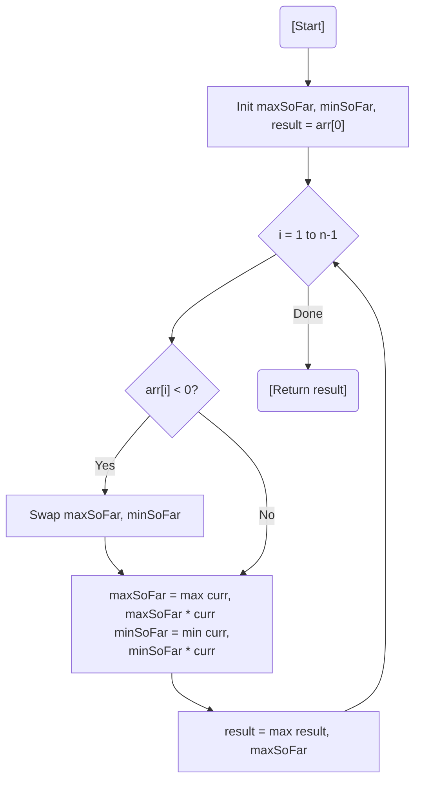

# 💡 Approach — Modified Kadane's with Max/Min Tracking

| 📄 [Problem](./Problem.md) | 💡 [Approach](./Approach.md) | 🧩 [Solution](./Solution.cpp) | 🚀 [Main](./Main.cpp) |
|:--------------------------:|:-----------------------------:|:------------------------------:|:---------------------:|

---

## 📊 Metadata

---

> [!TIP]
> **Core Insight:** In maximum product problems, we must track both the **maximum product** (largest positive) and the **minimum product** (most negative) because a negative number can multiply with a previous minimum to flip into a new maximum.

---

## 🔩 Step-by-Step Breakdown
1. **Initialize:** Set `maxSoFar`, `minSoFar`, and `result` to `arr[0]`.
2. **Loop:** Iterate through the array starting from index 1.
3. **Swap on Negative:** If the current element is negative, swap `maxSoFar` and `minSoFar` because multiplying by a negative number flips the signs.
4. **Update Pointers:**
   - `maxSoFar = max(curr, maxSoFar * curr)`
   - `minSoFar = min(curr, minSoFar * curr)`
5. **Global Update:** Update `result` with the maximum of itself and `maxSoFar`.
6. **Return Result:** The global maximum found.

---

## 🔄 Mermaid Flowchart

---

## 📊 Complexity Analysis
| Type | Complexity |
| :--- | :--- |
| **Time Complexity** | $O(N)$ - Single pass through the array. |
| **Space Complexity** | $O(1)$ - Constant auxiliary space. |

---

> *"In the world of products, two negatives don't just cancel out; they might create a giant."*

---

<h3>Happy Coding! 🚀</h3>

