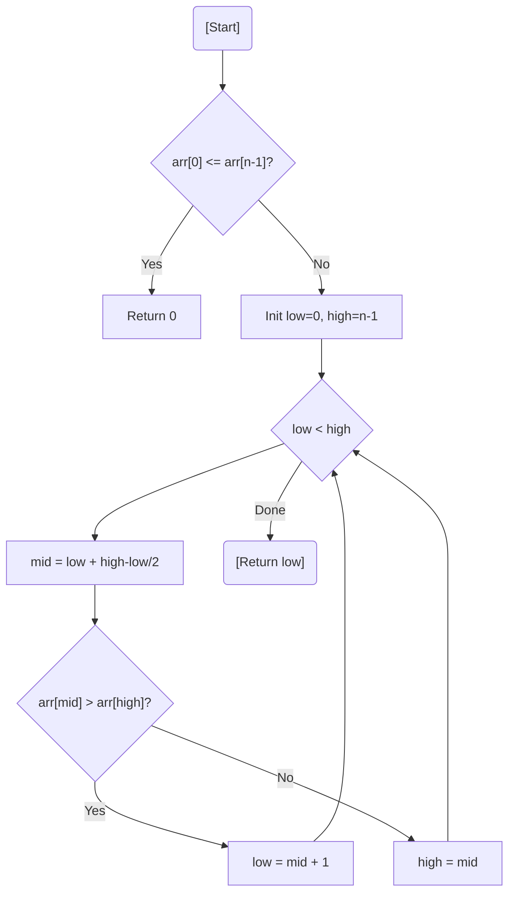

# 💡 Approach — Binary Search for Minimum Element

| 📄 [Problem](./Problem.md) | 💡 [Approach](./Approach.md) | 🧩 [Solution](./Solution.cpp) | 🚀 [Main](./Main.cpp) |
|:--------------------------:|:-----------------------------:|:------------------------------:|:---------------------:|

---

## 📊 Metadata

---

> [!TIP]
> **Core Insight:** In a sorted rotated array, the number of right rotations is exactly equal to the **index of the minimum element**. Since the array was originally sorted, we can find this index in $O(\log N)$ using Binary Search.

---

## 🔩 Step-by-Step Breakdown
1. **Sorted Check:** If `arr[0] <= arr[n-1]`, the array is not rotated (return `0`).
2. **Binary Search:**
   - Initialize `low = 0`, `high = n-1`.
   - Calculate `mid = low + (high - low) / 2`.
   - If `arr[mid] > arr[high]`: The minimum element must be in the right half (set `low = mid + 1`).
   - Else: The minimum element is in the left half or is `mid` itself (set `high = mid`).
3. **Loop End:** When `low == high`, `low` points to the minimum element's index.
4. **Result:** Return `low`.

---

## 🔄 Mermaid Flowchart

---

## 📊 Complexity Analysis
| Type | Complexity |
| :--- | :--- |
| **Time Complexity** | $O(\log N)$ - Standard Binary Search approach. |
| **Space Complexity** | $O(1)$ - No auxiliary space used. |

---

> *"The pivot point is the key; find the smallest, and the rotation is revealed."*

---

<h3>Happy Coding! 🚀</h3>

