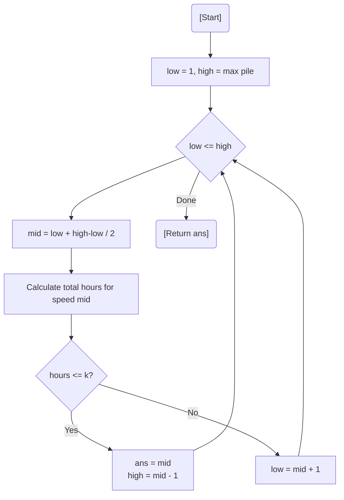

# 💡 Approach — Binary Search on Answer

| 📄 [Problem](./Problem.md) | 💡 [Approach](./Approach.md) | 🧩 [Solution](./Solution.cpp) | 🚀 [Main](./Main.cpp) |
|:--------------------------:|:-----------------------------:|:------------------------------:|:---------------------:|

---

## 📊 Metadata

---

> [!TIP]
> **Core Insight:** The required eating speed `s` follows a monotonic property: if speed `s` allows Koko to finish on time, any speed greater than `s` also works. This allows us to perform **Binary Search** over the range of possible speeds $[1, \max(arr)]$.

---

## 🔩 Step-by-Step Breakdown
1. **Define Range:** The minimum speed is $1$, and the maximum speed needed is the size of the largest pile $\max(arr)$.
2. **Binary Search:**
   - Calculate `mid` (the candidate speed).
   - Calculate total `hours` required: $\sum \lceil pile[i] / mid \rceil$.
   - If `hours <= k`: This speed is viable. Store it and try a smaller speed (`high = mid - 1`).
   - Else: This speed is too slow. Try a faster speed (`low = mid + 1`).
3. **Optimized Ceiling:** Use `(pile + mid - 1) / mid` for integer-based ceiling calculation.
4. **Result:** The stored minimum viable speed.

---

## 🔄 Mermaid Flowchart

---

## 📊 Complexity Analysis
| Type | Complexity |
| :--- | :--- |
| **Time Complexity** | $O(N \log(\max(arr)))$ - Binary search over speed range multiplied by linear pass for hour calculation. |
| **Space Complexity** | $O(1)$ - Constant space usage. |

---

> *"Find the rhythm that finishes the feast just in time."*

---

<h3>Happy Coding! 🚀</h3>

