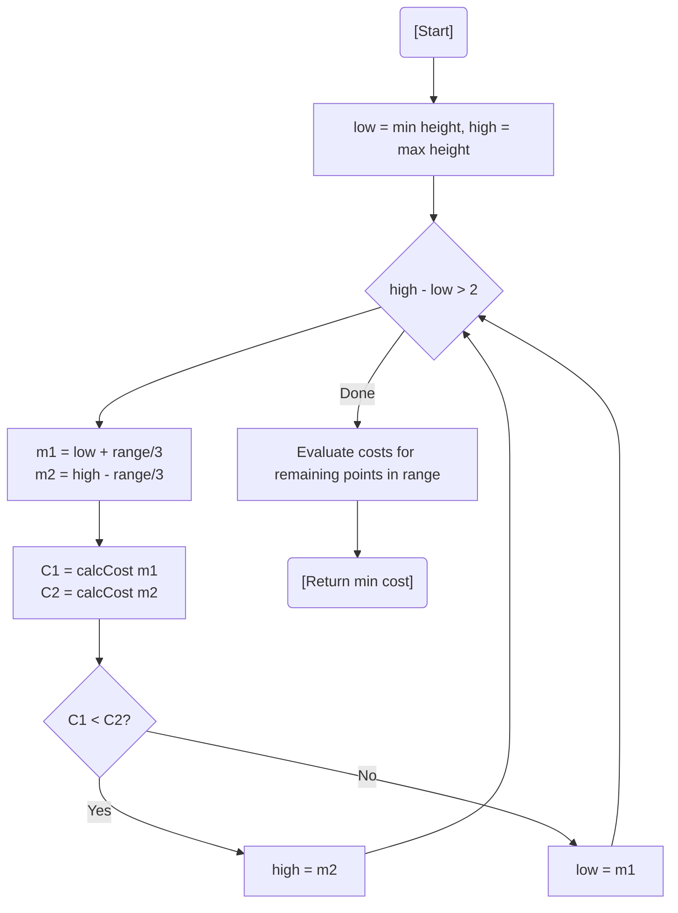

# 💡 Approach — Ternary Search on Convex Cost Function

| 📄 [Problem](./Problem.md) | 💡 [Approach](./Approach.md) | 🧩 [Solution](./Solution.cpp) | 🚀 [Main](./Main.cpp) |
|:--------------------------:|:-----------------------------:|:------------------------------:|:---------------------:|

---

## 📊 Metadata

---

> [!TIP]
> **Core Insight:** The total cost function $f(h) = \sum |height_i - h| \times cost_i$ is **convex** (U-shaped). This allows us to use **Ternary Search** to find the minimum cost by evaluating midpoints and narrowing the search space to the optimal target height.

---

## 🔩 Step-by-Step Breakdown
1. **Range:** The optimal height must lie between `min(heights)` and `max(heights)`.
2. **Ternary Search:**
   - Define midpoints $m1$ and $m2$ at $1/3$ and $2/3$ of the current range.
   - Calculate total costs $C1$ and $C2$ for heights $m1$ and $m2$.
   - If $C1 < C2$: The minimum is closer to $m1$ or the left; set `high = m2`.
   - Else: The minimum is closer to $m2$ or the right; set `low = m1`.
3. **Refinement:** Continue until the range is small (e.g., size 3), then evaluate the remaining points linearly to find the absolute minimum.
4. **Result:** The minimum cost found.

---

## 🔄 Mermaid Flowchart

---

## 📊 Complexity Analysis
| Type | Complexity |
| :--- | :--- |
| **Time Complexity** | $O(N \log_3(\max(H)))$ - Linear cost calculation at each ternary search step. |
| **Space Complexity** | $O(1)$ - Constant space usage. |

---

> *"In a field of towers, the shortest path to balance is found by narrowing the middle."*

---

<h3>Happy Coding! 🚀</h3>

