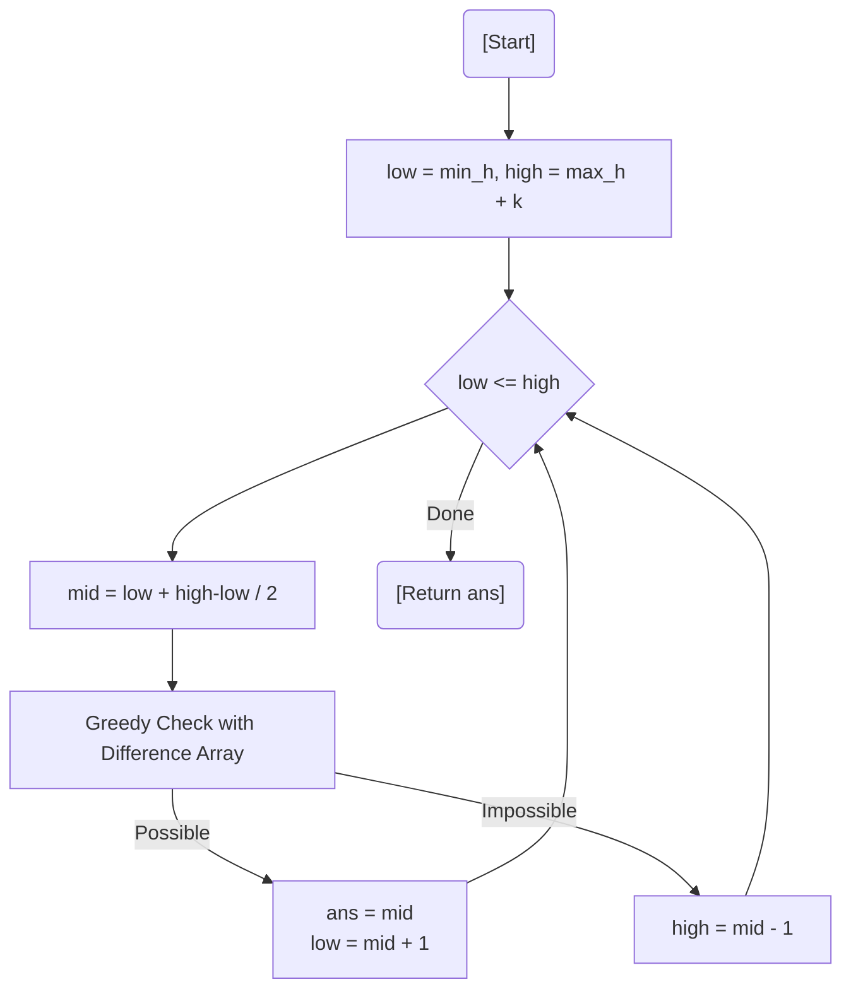

# 💡 Approach — Binary Search on Answer + Difference Array

| 📄 [Problem](./Problem.md) | 💡 [Approach](./Approach.md) | 🧩 [Solution](./Solution.cpp) | 🚀 [Main](./Main.cpp) |
|:--------------------------:|:-----------------------------:|:------------------------------:|:---------------------:|

---

## 📊 Metadata

---

> [!TIP]
> **Core Insight:** "Maximize the minimum" problems are almost always solved by **Binary Search on the Answer**. If we can achieve a minimum height $H$, we can achieve any height $< H$. We use a **Difference Array** to greedily apply watering in $O(N)$ during the check.

---

## 🔩 Step-by-Step Breakdown
1. **Binary Search Range:** The answer lies between the current minimum height and `max(arr) + k`.
2. **Greedy Check Function:**
   - Iterate through flowers from left to right.
   - Maintain a `currentWater` effect using a difference array to track when watering windows end.
   - If `arr[i] + currentWater < target`:
     - We must water the next $W$ flowers starting from $i$ to cover this deficiency.
     - Calculate `needed = target - (arr[i] + currentWater)`.
     - If `needed > k_remaining`, return `false`.
     - Update `currentWater`, `k_remaining`, and record the end of this effect at `i + W`.
3. **Optimized Updates:** Use a difference array `diff[i+w] -= needed` to handle range additions efficiently.
4. **Result:** The maximum `target` that returns `true`.

---

## 🔄 Mermaid Flowchart

---

## 📊 Complexity Analysis
| Type | Complexity |
| :--- | :--- |
| **Time Complexity** | $O(N \log(\text{MaxHeight}))$ - Binary search over possible heights with linear greedy pass. |
| **Space Complexity** | $O(N)$ - Difference array to manage watering effects. |

---

> *"The growth of one flower is a local event; the growth of a row is a strategic campaign."*

---

<h3>Happy Coding! 🚀</h3>

