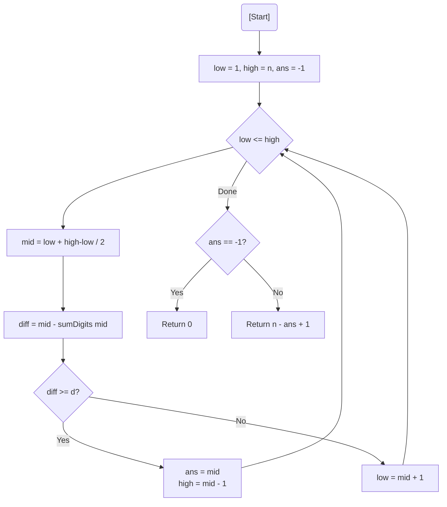

# 💡 Approach — Binary Search on Monotonic Difference Function

| 📄 [Problem](./Problem.md) | 💡 [Approach](./Approach.md) | 🧩 [Solution](./Solution.cpp) | 🚀 [Main](./Main.cpp) |
|:--------------------------:|:-----------------------------:|:------------------------------:|:---------------------:|

---

## 📊 Metadata

---

> [!TIP]
> **Core Insight:** The function $f(x) = x - \text{sumDigits}(x)$ is **non-decreasing**. If a number $x$ satisfies $f(x) \ge d$, then any number $y > x$ will also satisfy it. This allows us to use **Binary Search** to find the smallest such $x$.

---

## 🔩 Step-by-Step Breakdown
1. **Define Function:** Let $f(x) = x - \text{sumDigits}(x)$.
2. **Binary Search Range:** The search space is $[1, n]$.
3. **Execution:**
   - Calculate `mid`.
   - If $f(mid) \ge d$:
     - This `mid` is a potential candidate.
     - Try to find an even smaller $x$ by searching in the left half (`high = mid - 1`).
   - Else:
     - $f(mid)$ is too small. Search in the right half (`low = mid + 1`).
4. **Final Count:** Once the smallest $x$ is found, the count of numbers in $[x, n]$ is $n - x + 1$.

---

## 🔄 Mermaid Flowchart

---

## 📊 Complexity Analysis
| Type | Complexity |
| :--- | :--- |
| **Time Complexity** | $O(\log^2 N)$ - Binary search ($O(\log N)$) multiplied by digit summation ($O(\log N)$). |
| **Space Complexity** | $O(1)$ - Constant auxiliary space. |

---

> *"The gap between a number and its digits only grows as the number reaches for the stars."*

---

<h3>Happy Coding! 🚀</h3>

