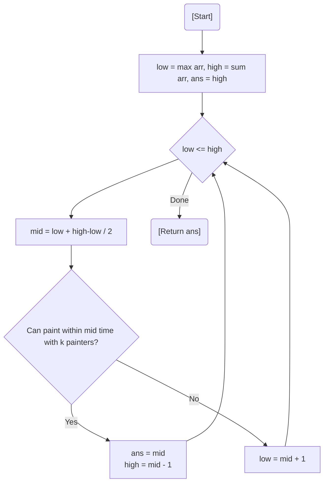

# 💡 Approach — Binary Search on Answer

| 📄 [Problem](./Problem.md) | 💡 [Approach](./Approach.md) | 🧩 [Solution](./Solution.cpp) | 🚀 [Main](./Main.cpp) |
|:--------------------------:|:-----------------------------:|:------------------------------:|:---------------------:|

---

## 📊 Metadata

---

> [!TIP]
> **Core Insight:** This is a classic **"Minimize the Maximum"** problem. If we can finish the job in time $T$, we can definitely finish it in any time $> T$. This monotonicity allows us to Binary Search for the minimum viable $T$.

---

## 🔩 Step-by-Step Breakdown
1. **Define Search Space:**
   - `low = max(arr)` (The largest single board requires at least its own length).
   - `high = sum(arr)` (Worst case: 1 painter does everything).
2. **Binary Search:**
   - Pick `mid` as the potential maximum time.
   - Check if $k$ painters can cover all boards such that no painter exceeds `mid` units.
   - If viable: `ans = mid`, search for a smaller time (`high = mid - 1`).
   - Else: Too restrictive, increase time (`low = mid + 1`).
3. **Greedy Verification:**
   - Iterate through boards. Accumulate lengths until the limit `mid` is exceeded.
   - When exceeded, increment painter count and start fresh with the current board.
4. **Result:** The smallest $T$ where $k$ painters are sufficient.

---

## 🔄 Mermaid Flowchart

---

## 📊 Complexity Analysis
| Type | Complexity |
| :--- | :--- |
| **Time Complexity** | $O(N \log(\sum arr))$ - Linear pass inside binary search. |
| **Space Complexity** | $O(1)$ - Constant space usage. |

---

> *"A painter's patience is finite, but a division of labor is infinite."*

---

<h3>Happy Coding! 🚀</h3>

