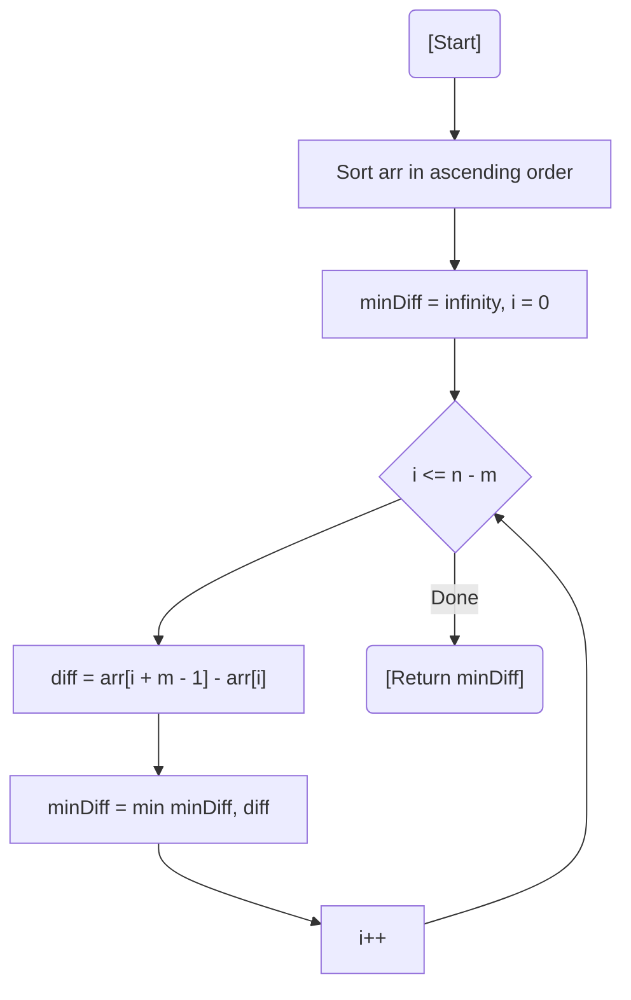

# 💡 Approach — Sorting & Sliding Window

| 📄 [Problem](./Problem.md) | 💡 [Approach](./Approach.md) | 🧩 [Solution](./Solution.cpp) | 🚀 [Main](./Main.cpp) |
|:--------------------------:|:-----------------------------:|:------------------------------:|:---------------------:|

---

## 📊 Metadata

---

> [!TIP]
> **Core Insight:** To minimize the difference between the largest and smallest packets, the selected packets should be as "close" as possible on the number line. In a sorted array, the minimum difference for $M$ packets will always occur in a contiguous subarray of size $M$.

---

## 🔩 Step-by-Step Breakdown
1. **Sort the Array:** Sort the chocolate packets in ascending order.
2. **Initialize:** Set `minDiff = LLONG_MAX`.
3. **Sliding Window:**
   - Iterate through the sorted array from index $i = 0$ to $n - m$.
   - For each index $i$, the window of $m$ packets ends at $i + m - 1$.
   - Calculate `diff = arr[i + m - 1] - arr[i]`.
   - Update `minDiff` with the minimum of itself and `diff`.
4. **Result:** Return the found `minDiff`.

---

## 🔄 Mermaid Flowchart

---

## 📊 Complexity Analysis
| Type | Complexity |
| :--- | :--- |
| **Time Complexity** | $O(N \log N)$ - Dominated by sorting the array. Sliding window is $O(N)$. |
| **Space Complexity** | $O(1)$ - Constant space (ignoring sorting recursion stack). |

---

> *"The sweetest distribution is the one where everyone feels equally favored."*

---

<h3>Happy Coding! 🚀</h3>

