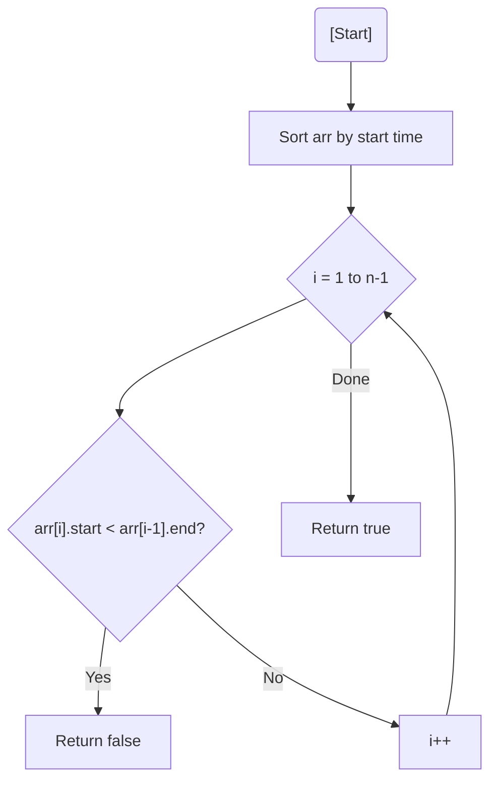

# 💡 Approach — Sorting & Overlap Check

| 📄 [Problem](./Problem.md) | 💡 [Approach](./Approach.md) | 🧩 [Solution](./Solution.cpp) | 🚀 [Main](./Main.cpp) |
|:--------------------------:|:-----------------------------:|:------------------------------:|:---------------------:|

---

## 📊 Metadata

---

> [!TIP]
> **Core Insight:** If we sort meetings by their start times, we only need to compare each meeting with the one that immediately preceded it to detect any overlaps.

---

## 🔩 Step-by-Step Breakdown
1. **Sort:** Sort all meetings based on their starting times.
2. **Iterate:** Traverse the sorted meetings starting from the second one (index 1).
3. **Compare:** For each meeting $i$, check if its start time $arr[i][0]$ is strictly less than the end time of the previous meeting $arr[i-1][1]$.
4. **Conclusion:**
   - If $arr[i][0] < arr[i-1][1]$, return `false` (overlap detected).
   - If the loop finishes without returning, return `true`.

---

## 🔄 Mermaid Flowchart

---

## 📊 Complexity Analysis
| Type | Complexity |
| :--- | :--- |
| **Time Complexity** | $O(N \log N)$ - Dominated by sorting. Overlap check is $O(N)$. |
| **Space Complexity** | $O(1)$ - Constant space (excluding sort stack). |

---

> *"Punctuality is not just being on time, it's making sure your time doesn't steal from another."*

---

<h3>Happy Coding! 🚀</h3>

