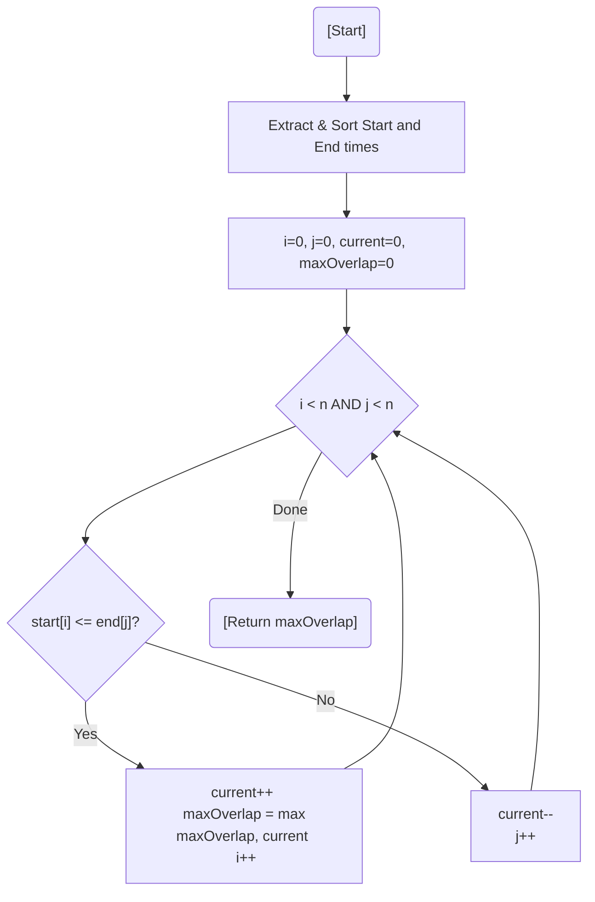

# 💡 Approach — Two-Pointer Sweep Line

| 📄 [Problem](./Problem.md) | 💡 [Approach](./Approach.md) | 🧩 [Solution](./Solution.cpp) | 🚀 [Main](./Main.cpp) |
|:--------------------------:|:-----------------------------:|:------------------------------:|:---------------------:|

---

## 📊 Metadata

---

> [!TIP]
> **Core Insight:** Overlap happens when an interval starts before another one ends. By splitting start and end times into two sorted arrays, we can simulate a "sweep line" that moves across time and counts how many intervals are active.

---

## 🔩 Step-by-Step Breakdown
1. **Extraction:** Create two separate arrays: `start_times` and `end_times`.
2. **Sorting:** Sort both arrays in ascending order.
3. **Simultaneous Traversal:** Use two pointers $i$ (for starts) and $j$ (for ends).
4. **Condition:**
   - If `start_times[i] <= end_times[j]`: An interval starts (or overlaps at the boundary). Increment `current_overlap` and update `max_overlap`.
   - Else: An interval has ended. Decrement `current_overlap` and move the end pointer $j$.
5. **Result:** The `max_overlap` recorded during the process is the answer.

---

## 🔄 Mermaid Flowchart

---

## 📊 Complexity Analysis
| Type | Complexity |
| :--- | :--- |
| **Time Complexity** | $O(N \log N)$ - Dominated by sorting both arrays. |
| **Space Complexity** | $O(N)$ - To store separate start and end times. |

---

> *"Time is a line, and overlaps are its intersections. By sorting the moments, we clarify the chaos."*

---

<h3>Happy Coding! 🚀</h3>

