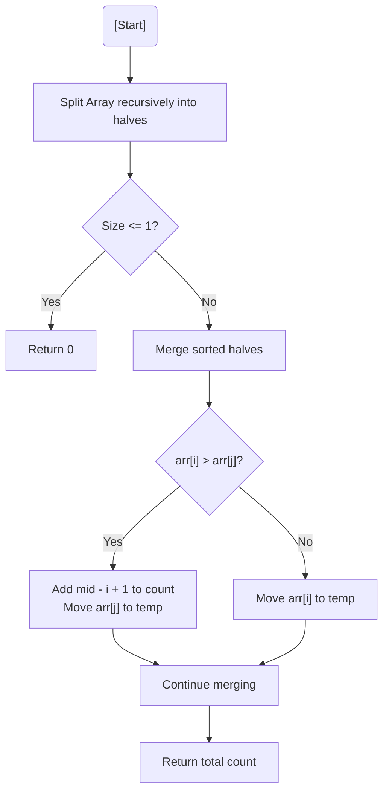

# 💡 Approach — Merge Sort with Inversion Counting

| 📄 [Problem](./Problem.md) | 💡 [Approach](./Approach.md) | 🧩 [Solution](./Solution.cpp) | 🚀 [Main](./Main.cpp) |
|:--------------------------:|:-----------------------------:|:------------------------------:|:---------------------:|

---

## 📊 Metadata

---

> [!TIP]
> **Core Insight:** Inversion counting is a byproduct of sorting. During the merge step of Merge Sort, if an element from the right half is smaller than an element from the left half, it forms an inversion with that element **and all subsequent elements** in the left half (since they are already sorted).

---

## 🔩 Step-by-Step Breakdown
1. **Divide:** Recursively split the array into two halves until individual elements are reached.
2. **Conquer (Merge and Count):**
   - Maintain pointers `i` for the left half and `j` for the right half.
   - If `arr[i] <= arr[j]`: Not an inversion. Move `arr[i]` to temp and increment `i`.
   - If `arr[i] > arr[j]`: Inversion detected!
     - Since the left half is sorted, `arr[j]` is smaller than all elements from `i` to `mid`.
     - `count += (mid - i + 1)`.
     - Move `arr[j]` to temp and increment `j`.
3. **Assemble:** Copy elements back from the temporary array to the original array.
4. **Return:** Sum up counts from all recursive calls.

---

## 🔄 Mermaid Flowchart

---

## 📊 Complexity Analysis
| Type | Complexity |
| :--- | :--- |
| **Time Complexity** | $O(N \log N)$ - Standard Merge Sort complexity. |
| **Space Complexity** | $O(N)$ - For the auxiliary temporary array. |

---

> *"An inversion is just a memory of an unsorted past, corrected by the logic of division."*

---

<h3>Happy Coding! 🚀</h3>

