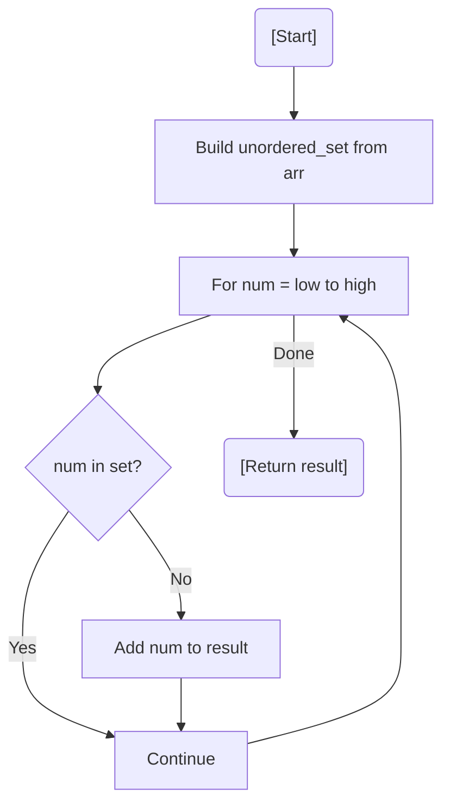

# 💡 Approach — Set-Based Range Check

| 📄 [Problem](./Problem.md) | 💡 [Approach](./Approach.md) | 🧩 [Solution](./Solution.cpp) | 🚀 [Main](./Main.cpp) |
|:--------------------------:|:-----------------------------:|:------------------------------:|:---------------------:|

---

## 📊 Metadata

---

> [!TIP]
> **Core Insight:** By mapping all existing elements into a hash set, we reduce the "is it present?" check to constant time $O(1)$. Since we need missing elements in sorted order, we simply iterate through the range from `low` to `high`.

---

## 🔩 Step-by-Step Breakdown
1. **Set Construction:** Insert all elements of `arr[]` into an `unordered_set<int>`.
2. **Linear Probe:**
   - Iterate through every integer `num` from `low` to `high`.
   - Check if `num` exists in the set.
   - If not found, add it to the `result` vector.
3. **Sorted Result:** Because the loop runs from `low` to `high`, the `result` vector is naturally sorted.
4. **Return:** Return the collected missing numbers.

---

## 🔄 Mermaid Flowchart

---

## 📊 Complexity Analysis
| Type | Complexity |
| :--- | :--- |
| **Time Complexity** | $O(N + (high - low))$ - $N$ to build the set, and range size for iteration. |
| **Space Complexity** | $O(N)$ - To store unique elements in the hash set. |

---

> *"The void between what is and what should be is found by counting the silence."*

---

<h3>Happy Coding! 🚀</h3>

