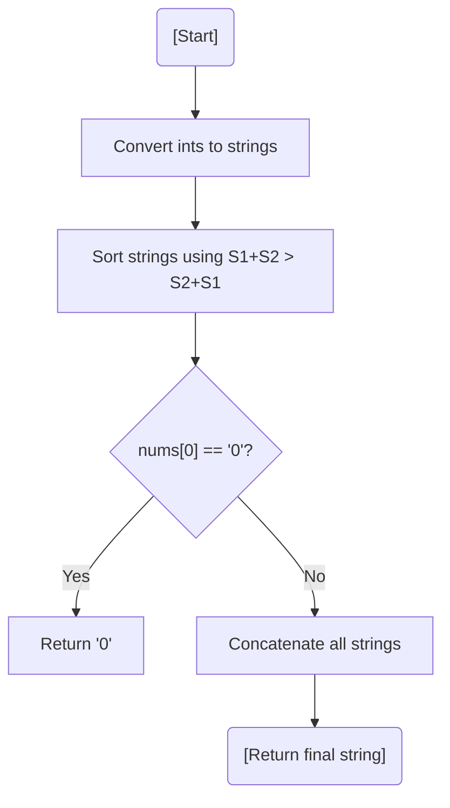

# 💡 Approach — Custom Sorting with Greedy Concatenation

| 📄 [Problem](./Problem.md) | 💡 [Approach](./Approach.md) | 🧩 [Solution](./Solution.cpp) | 🚀 [Main](./Main.cpp) |
|:--------------------------:|:-----------------------------:|:------------------------------:|:---------------------:|

---

## 📊 Metadata

---

> [!TIP]
> **Core Insight:** This is a greedy problem where local decisions lead to the global maximum. To decide between two numbers $A$ and $B$, simply check if $A+B$ is larger than $B+A$. This custom comparison ensures that the most significant digits appear earlier in the final string.

---

## 🔩 Step-by-Step Breakdown
1. **Conversion:** Convert all integers into strings to facilitate concatenation.
2. **Custom Sort:** Use a custom comparator:
   - For strings $S_1$ and $S_2$, compare $S_1 + S_2$ with $S_2 + S_1$.
   - Sort the array of strings in descending order based on this rule.
3. **Zero Case:** If the highest value string is `"0"`, the entire result is `"0"` (avoids strings like `"000"`).
4. **Result:** Concatenate all strings in the sorted order and return.

---

## 🔄 Mermaid Flowchart

---

## 📊 Complexity Analysis
| Type | Complexity |
| :--- | :--- |
| **Time Complexity** | $O(N \log N \cdot K)$ - Sorting takes $O(N \log N)$ comparisons, each costing $O(K)$ for string concatenation. |
| **Space Complexity** | $O(N \cdot K)$ - Space to store integers as strings. |

---

> *"The largest whole is built by choosing the greatest parts at every step."*

---

<h3>Happy Coding! 🚀</h3>

