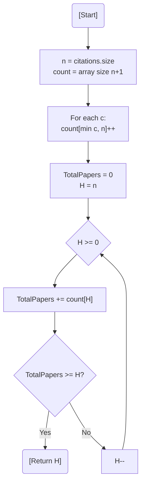

# 💡 Approach — Bucket Sort (Counting Strategy)

| 📄 [Problem](./Problem.md) | 💡 [Approach](./Approach.md) | 🧩 [Solution](./Solution.cpp) | 🚀 [Main](./Main.cpp) |
|:--------------------------:|:-----------------------------:|:------------------------------:|:---------------------:|

---

## 📊 Metadata

---

> [!TIP]
> **Core Insight:** The H-index cannot exceed the total number of papers $N$. By clamping all citation counts $> N$ to $N$, we can use a frequency array (buckets) to count papers in linear time, avoiding the $O(N \log N)$ cost of sorting.

---

## 🔩 Step-by-Step Breakdown
1. **Frequency Mapping:**
   - Create a `count` array of size $N+1$.
   - For each citation $C$, if $C \ge N$, increment `count[N]`. Otherwise, increment `count[C]`.
2. **Reverse Accumulation:**
   - Initialize `totalPapers = 0`.
   - Traverse the `count` array from $H = N$ down to $0$.
   - Add `count[H]` to `totalPapers`.
3. **Threshold Check:**
   - The first $H$ where `totalPapers >= H` is the researcher's H-index.
4. **Return:** Return $H$.

---

## 🔄 Mermaid Flowchart

---

## 📊 Complexity Analysis
| Type | Complexity |
| :--- | :--- |
| **Time Complexity** | $O(N)$ - One pass to build the frequency array, another to find the index. |
| **Space Complexity** | $O(N)$ - To store the count array of size $N+1$. |

---

> *"An author's impact is not just in the volume of their voice, but in the echo that reaches the height of their ambition."*

---

<h3>Happy Coding! 🚀</h3>

