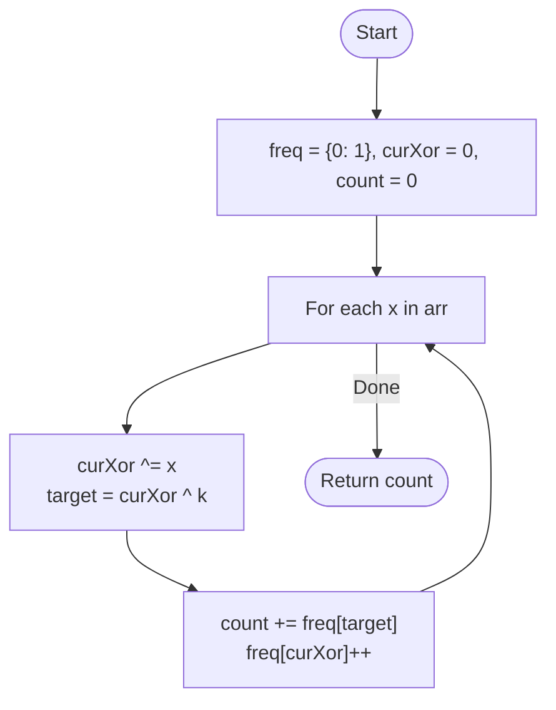

# 💡 Approach — Prefix XOR & Hash Map

| 📄 [Problem](./Problem.md) | 💡 [Approach](./Approach.md) | 🧩 [Solution](./Solution.cpp) | 🚀 [Main](./Main.cpp) |
|:--------------------------:|:-----------------------------:|:------------------------------:|:---------------------:|

---

## 📊 Metadata

---

> [!TIP]
> **Core Insight:** If the XOR sum of elements from index $0$ to $i$ is $P$, and we want a subarray ending at $i$ with XOR sum $k$, we need a previous prefix XOR $X$ such that $X \oplus k = P$. This rearranges to $X = P \oplus k$.

---

## 🔩 Step-by-Step Breakdown
1. **Initialize:** Maintain a hash map `freq` to store the frequency of prefix XOR values. Seed it with `freq[0] = 1`.
2. **Accumulate:** Iterate through the array, maintaining a running `currentXor`.
3. **Target Search:** For each element:
   - Calculate `target = currentXor ^ k`.
   - Add the count of `target` from the map to your total `result`.
   - Increment the frequency of `currentXor` in the map.
4. **Return:** Return the total count of subarrays.

---

## 🔄 Mermaid Flowchart

---

## 📊 Complexity Analysis
| Type | Complexity |
| :--- | :--- |
| **Time Complexity** | $O(N)$ - Single pass using a hash map for $O(1)$ average lookups. |
| **Space Complexity** | $O(N)$ - Space to store prefix XOR frequencies in the map. |

---

> *"In the logic of XOR, the past and the present reveal the missing piece."*

---

<h3>Happy Coding! 🚀</h3>

