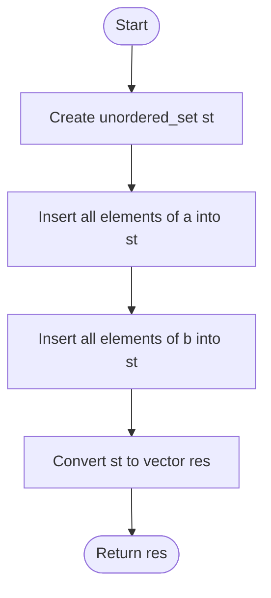

# 💡 Approach — Hash Set for Distinct Elements

| 📄 [Problem](./Problem.md) | 💡 [Approach](./Approach.md) | 🧩 [Solution](./Solution.cpp) | 🚀 [Main](./Main.cpp) |
|:--------------------------:|:-----------------------------:|:------------------------------:|:---------------------:|

---

## 📊 Metadata

---

> [!TIP]
> **Core Insight:** A Hash Set (unordered_set) is the ideal data structure for union operations because it enforces uniqueness. By inserting all elements from both arrays into a single set, duplicates are automatically filtered out in average constant time.

---

## 🔩 Step-by-Step Breakdown
1. **Initialize:** Create an `unordered_set<int>` to store distinct elements.
2. **Collect Array A:** Iterate through array `a` and insert every element into the set.
3. **Collect Array B:** Iterate through array `b` and insert every element into the set.
4. **Convert:** Transfer the elements from the set into a vector.
5. **Return:** Return the vector representing the union.

---

## 🔄 Mermaid Flowchart

---

## 📊 Complexity Analysis
| Type | Complexity |
| :--- | :--- |
| **Time Complexity** | $O(N + M)$ - Average time for insertions into the hash set. |
| **Space Complexity** | $O(N + M)$ - To store all distinct elements in the set. |

---

> *"Union is not just addition; it is the convergence of identities into a unique whole."*

---

<h3>Happy Coding! 🚀</h3>

