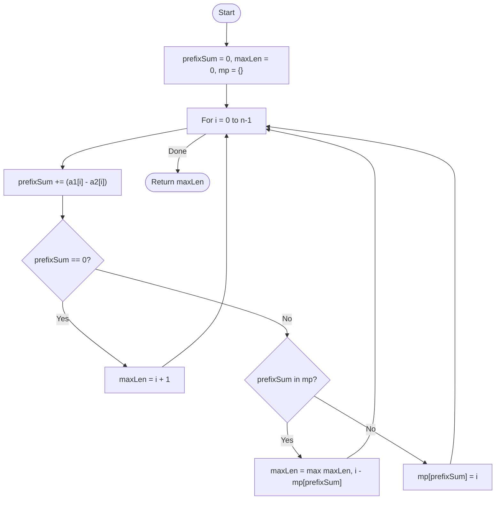

# 💡 Approach — Difference Array & Hashing

| 📄 [Problem](./Problem.md) | 💡 [Approach](./Approach.md) | 🧩 [Solution](./Solution.cpp) | 🚀 [Main](./Main.cpp) |
|:--------------------------:|:-----------------------------:|:------------------------------:|:---------------------:|

---

## 📊 Metadata

---

> [!TIP]
> **Core Insight:** If $\sum a1[i..j] = \sum a2[i..j]$, then $\sum (a1[i..j] - a2[i..j]) = 0$. By working with the difference of the two arrays, we transform the problem into finding the **longest subarray with sum zero**.

---

## 🔩 Step-by-Step Breakdown
1. **Define Difference:** Let `diff[k] = a1[k] - a2[k]`. We need the longest $[i, j]$ where $\sum_{k=i}^{j} diff[k] = 0$.
2. **Prefix Sum Hashing:**
   - Maintain a running `prefixSum` of the `diff` values.
   - Use a hash map to store the **first occurrence** of each `prefixSum`.
3. **Traverse:**
   - If `prefixSum == 0`: The entire span from start to current index $i$ has sum zero. `maxLen = i + 1`.
   - If `prefixSum` has been seen before at index $j$: The subarray between $j$ and $i$ has sum zero. `maxLen = max(maxLen, i - j)`.
   - If `prefixSum` is new: Store it with the current index: `map[prefixSum] = i`.
4. **Result:** The `maxLen` found is the answer.

---

## 🔄 Mermaid Flowchart

---

## 📊 Complexity Analysis
| Type | Complexity |
| :--- | :--- |
| **Time Complexity** | $O(N)$ - Single pass through the arrays with $O(1)$ average hash map lookups. |
| **Space Complexity** | $O(N)$ - To store the first occurrence of prefix sums in the hash map. |

---

> *"The balance of two arrays is found in the stillness of their difference."*

---

<h3>Happy Coding! 🚀</h3>

