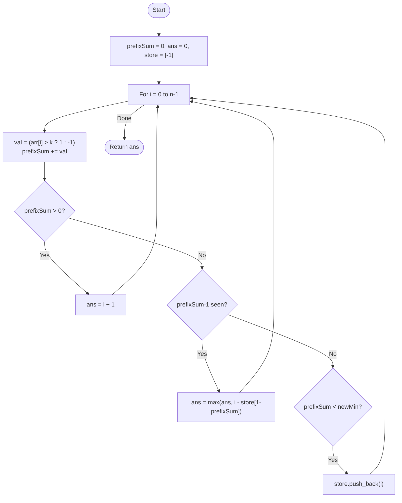

# 💡 Approach — Transformation & Earliest Prefix

| 📄 [Problem](./Problem.md) | 💡 [Approach](./Approach.md) | 🧩 [Solution](./Solution.cpp) | 🚀 [Main](./Main.cpp) |
|:--------------------------:|:-----------------------------:|:------------------------------:|:---------------------:|

---

## 📊 Metadata

---

> [!TIP]
> **Core Insight:** Transform the problem by assigning $+1$ to elements $> k$ and $-1$ to elements $\le k$. A subarray satisfies the condition if its sum is strictly positive ($\ge 1$).

---

## 🔩 Step-by-Step Breakdown
1. **Transformation:**
   - For each $arr[i]$, let $v_i = 1$ if $arr[i] > k$, else $v_i = -1$.
2. **Prefix Sum Accumulation:**
   - Maintain a running `prefixSum`.
   - Goal: Find the longest $[j, i]$ such that $prefixSum[i] - prefixSum[j-1] > 0$.
3. **Optimized Search:**
   - If `prefixSum > 0`: The entire range $[0..i]$ is valid. `maxLen = i + 1`.
   - If `prefixSum <= 0`: We need the earliest index $j$ where $prefixSum[j] = prefixSum - 1$. 
   - Since the prefix sum changes by exactly $\pm 1$ at each step, we only need to store the first time we hit a new negative minimum.
4. **Earliest Index Store:**
   - Use a vector `store` where `store[abs(val)]` is the earliest index reaching prefix sum `val`.

---

## 🔄 Mermaid Flowchart

---

## 📊 Complexity Analysis
| Type | Complexity |
| :--- | :--- |
| **Time Complexity** | $O(N)$ - Single pass through the array. |
| **Space Complexity** | $O(N)$ - To store earliest indices for prefix sums. |

---

> *"When weights are balanced against a threshold, the longest path is found by identifying the first tilt."*

---

<h3>Happy Coding! 🚀</h3>

