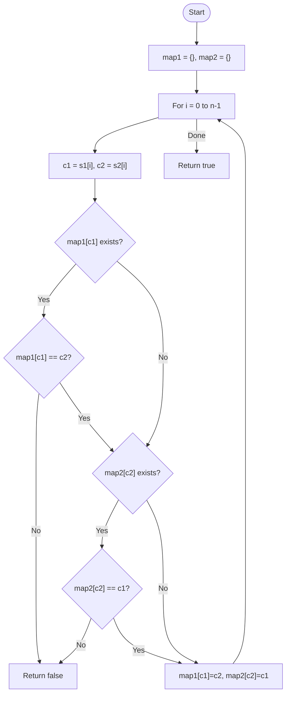

# 💡 Approach — Bidirectional Mapping

| 📄 [Problem](./Problem.md) | 💡 [Approach](./Approach.md) | 🧩 [Solution](./Solution.cpp) | 🚀 [Main](./Main.cpp) |
|:--------------------------:|:-----------------------------:|:------------------------------:|:---------------------:|

---

## 📊 Metadata

---

> [!TIP]
> **Core Insight:** Isomorphism is a bijective relation (one-to-one and onto). To validate it, we must ensure that no character in $S1$ maps to multiple characters in $S2$, and no character in $S2$ is mapped to by multiple characters in $S1$.

---

## 🔩 Step-by-Step Breakdown
1. **Length Check:** If lengths of `s1` and `s2` differ, return `false`.
2. **Two-Way Mapping:**
   - Use two maps (or arrays of size 256 for ASCII) to store the mapping:
     - `map1[char]`: Character in $S1$ maps to which char in $S2$.
     - `map2[char]`: Character in $S2$ is mapped from which char in $S1$.
3. **Validation Loop:** Iterate through the strings:
   - Let $c1 = s1[i]$ and $c2 = s2[i]$.
   - Check `map1`: If $c1$ is already mapped but not to $c2$, return `false`.
   - Check `map2`: If $c2$ is already mapped but not from $c1$, return `false`.
   - Update both maps: `map1[c1] = c2` and `map2[c2] = c1`.
4. **Conclusion:** If the loop finishes, the strings are isomorphic. Return `true`.

---

## 🔄 Mermaid Flowchart

---

## 📊 Complexity Analysis
| Type | Complexity |
| :--- | :--- |
| **Time Complexity** | $O(N)$ - Single pass through both strings. |
| **Space Complexity** | $O(1)$ - Fixed size mapping arrays (constant overhead for character sets). |

---

> *"Isomorphism is the symmetry of logic hidden within the structure of strings."*

---

<h3>Happy Coding! 🚀</h3>

