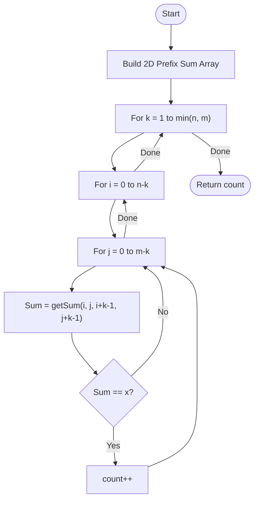

# 💡 Approach — 2D Prefix Sum & Sliding Window

| 📄 [Problem](./Problem.md) | 💡 [Approach](./Approach.md) | 🧩 [Solution](./Solution.cpp) | 🚀 [Main](./Main.cpp) |
|:--------------------------:|:-----------------------------:|:------------------------------:|:---------------------:|

---

## 📊 Metadata

---

> [!TIP]
> **Core Insight:** To efficiently calculate the sum of any submatrix, use a 2D prefix sum. This allows us to find the sum of any square of size $k$ in $O(1)$ time, reducing the total complexity from $O(N^4)$ to $O(N^3)$.

---

## 🔩 Step-by-Step Breakdown
1. **Build 2D Prefix Sum:**
   - Create a 2D array `pre[n+1][m+1]`.
   - `pre[i][j]` stores the sum of all elements in the rectangle from $(0,0)$ to $(i-1, j-1)$.
   - Formula: `pre[i][j] = mat[i-1][j-1] + pre[i-1][j] + pre[i][j-1] - pre[i-1][j-1]`.
2. **Submatrix Sum Query:**
   - The sum of a square with top-left $(r1, c1)$ and side $k$ (bottom-right $(r1+k-1, c1+k-1)$) is:
   - `sum = pre[r2+1][c2+1] - pre[r1][c2+1] - pre[r2+1][c1] + pre[r1][c1]`.
3. **Iterative Search:**
   - Loop through all possible side lengths $k$ from $1$ to $min(n, m)$.
   - Loop through all possible top-left corners $(i, j)$ such that $i+k \le n$ and $j+k \le m$.
   - Calculate the sum using the $O(1)$ query and compare with $x$.
4. **Return Result:** Total count of squares meeting the criteria.

---

## 🔄 Mermaid Flowchart

---

## 📊 Complexity Analysis
| Type | Complexity |
| :--- | :--- |
| **Time Complexity** | $O(N \cdot M \cdot \min(N, M))$ - Precomputing takes $O(NM)$, searching takes $O(N^2 M)$. |
| **Space Complexity** | $O(N \cdot M)$ - Space for the 2D prefix sum array. |

---

> *"In the geometry of numbers, the area of a square is fixed, but its sum reveals its hidden depth."*

---

<h3>Happy Coding! 🚀</h3>

