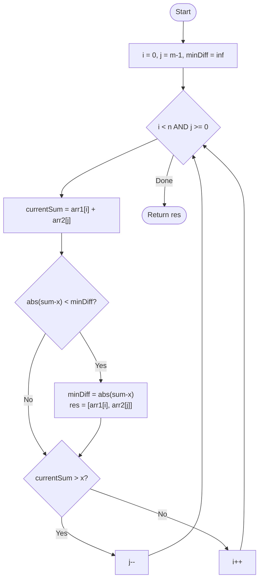

# 💡 Approach — Two Pointers Technique

| 📄 [Problem](./Problem.md) | 💡 [Approach](./Approach.md) | 🧩 [Solution](./Solution.cpp) | 🚀 [Main](./Main.cpp) |
|:--------------------------:|:-----------------------------:|:------------------------------:|:---------------------:|

---

## 📊 Metadata

---

> [!TIP]
> **Core Insight:** Since both arrays are already sorted, we can navigate the "sum space" using two pointers starting from opposite ends (smallest of $arr1$ and largest of $arr2$). This allows us to narrow down the closest sum in linear time without checking all $N \times M$ pairs.

---

## 🔩 Step-by-Step Breakdown
1. **Initialize Pointers:**
   - Set `i = 0` (pointing to the start of `arr1`).
   - Set `j = m - 1` (pointing to the end of `arr2`).
2. **Track Minimum:**
   - Maintain `minDiff` initialized to a large value.
   - Maintain `res1` and `res2` to store the closest pair found.
3. **Converge:**
   - While `i < n` and `j >= 0`:
     - Calculate `currentSum = arr1[i] + arr2[j]`.
     - Calculate `currentDiff = abs(currentSum - x)`.
     - If `currentDiff < minDiff`: Update `minDiff`, `res1 = arr1[i]`, and `res2 = arr2[j]`.
     - If `currentSum < x`: We need a larger sum to get closer to $x$, so move `i` forward (`i++`).
     - If `currentSum > x`: We need a smaller sum, so move `j` backward (`j--`).
     - If `currentSum == x`: Break early (exact match found).
4. **Return:** The pair `[res1, res2]`.

---

## 🔄 Mermaid Flowchart

---

## 📊 Complexity Analysis
| Type | Complexity |
| :--- | :--- |
| **Time Complexity** | $O(N + M)$ - We traverse both arrays at most once. |
| **Space Complexity** | $O(1)$ - Only a few variables for pointers and minimum tracking. |

---

> *"Efficiency is finding the shortest distance between two points in a sorted world."*

---

<h3>Happy Coding! 🚀</h3>

