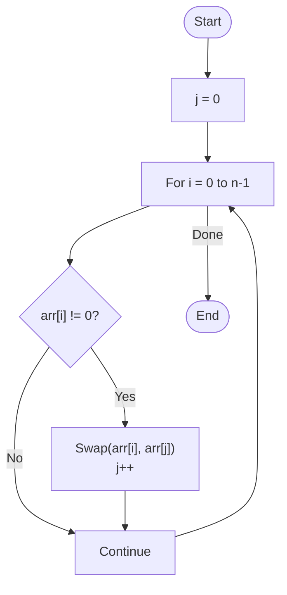

# 💡 Approach — Two Pointers (In-place Swap)

| 📄 [Problem](./Problem.md) | 💡 [Approach](./Approach.md) | 🧩 [Solution](./Solution.cpp) | 🚀 [Main](./Main.cpp) |
|:--------------------------:|:-----------------------------:|:------------------------------:|:---------------------:|

---

## 📊 Metadata

---

> [!TIP]
> **Core Insight:** A single pointer can track the "correct" position of the next non-zero element. By swapping non-zeroes into this position, all zeroes are naturally bubbled to the end while maintaining the relative order of other elements.

---

## 🔩 Step-by-Step Breakdown
1. **Initialize:** Use a pointer `j = 0` to represent the index where the next non-zero element should be placed.
2. **Iterate:** Use a pointer `i` to traverse the array from $0$ to $n-1$.
3. **Swap on Non-zero:**
   - Whenever `arr[i]` is non-zero:
     - Swap `arr[i]` and `arr[j]`.
     - Increment `j`.
4. **Completion:** By the time `i` reaches the end, all non-zero elements have been moved to the front (indices $0$ to $j-1$), and all zeroes have been pushed to the remaining positions ($j$ to $n-1$).

---

## 🔄 Mermaid Flowchart

---

## 📊 Complexity Analysis
| Type | Complexity |
| :--- | :--- |
| **Time Complexity** | $O(N)$ - Single pass through the array. |
| **Space Complexity** | $O(1)$ - In-place modification with constant extra space. |

---

> *"Progress is moving forward while ensuring nothing valuable is left behind."*

---

<h3>Happy Coding! 🚀</h3>

