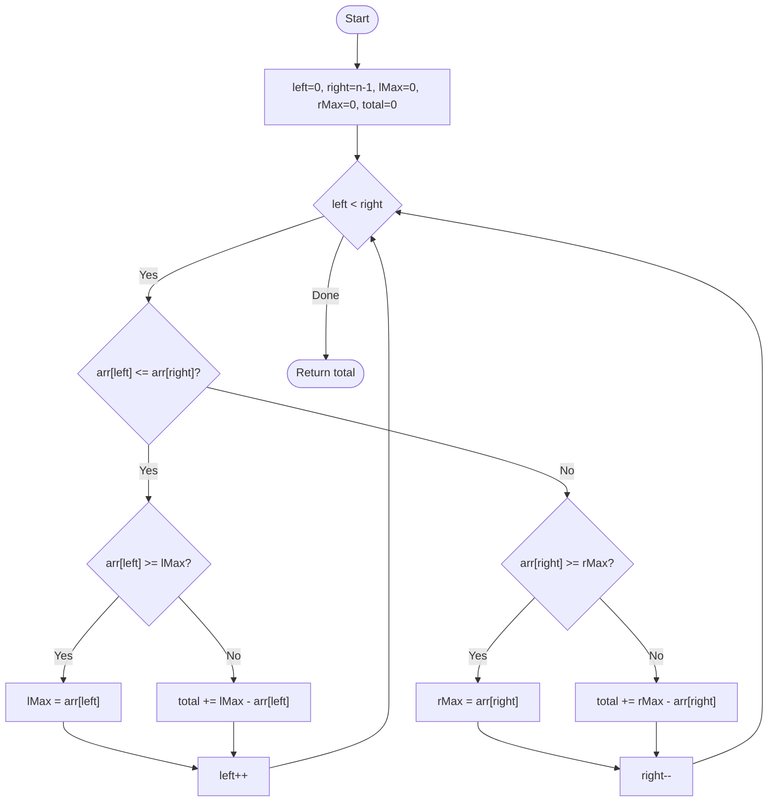

# 💡 Approach — Two Pointers Strategy

| 📄 [Problem](./Problem.md) | 💡 [Approach](./Approach.md) | 🧩 [Solution](./Solution.cpp) | 🚀 [Main](./Main.cpp) |
|:--------------------------:|:-----------------------------:|:------------------------------:|:---------------------:|

---

## 📊 Metadata

---

> [!TIP]
> **Core Insight:** The water trapped at any bar depends on the minimum of the maximum heights to its left and right. Using two pointers allows us to maintain the `leftMax` and `rightMax` simultaneously and compute the volume in a single $O(N)$ pass with $O(1)$ space.

---

## 🔩 Step-by-Step Breakdown
1. **Initialize:** 
   - `left = 0`, `right = n - 1`
   - `lMax = 0`, `rMax = 0`
   - `totalWater = 0`
2. **Two Pointer Convergence:**
   - While `left < right`:
     - **If `arr[left] <= arr[right]`**:
       - If `arr[left] >= lMax`, update `lMax = arr[left]`.
       - Else, water trapped at `left` is `lMax - arr[left]`.
       - `left++`.
     - **Else (`arr[left] > arr[right]`)**:
       - If `arr[right] >= rMax`, update `rMax = arr[right]`.
       - Else, water trapped at `right` is `rMax - arr[right]`.
       - `right--`.
3. **Completion:** The loop terminates when pointers meet, having accounted for every bar.

---

## 🔄 Mermaid Flowchart

---

## 📊 Complexity Analysis
| Type | Complexity |
| :--- | :--- |
| **Time Complexity** | $O(N)$ - Single pass through the array. |
| **Space Complexity** | $O(1)$ - Only constant extra variables used. |

---

> *"Water seeks the lowest point, but its volume is defined by the peaks that surround it."*

---

<h3>Happy Coding! 🚀</h3>

