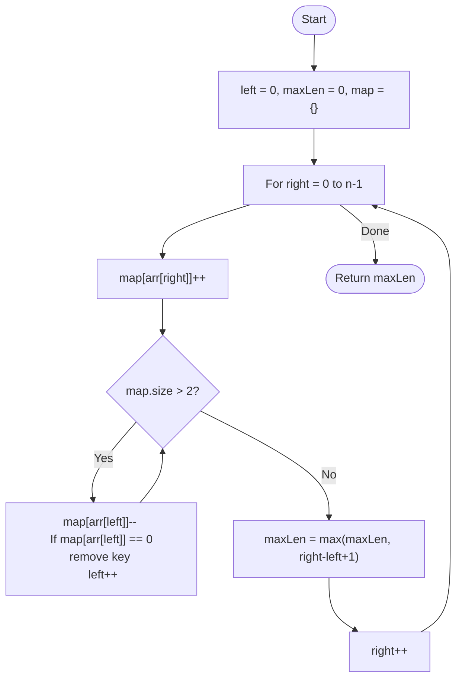

# 💡 Approach — Sliding Window (Variable Size)

| 📄 [Problem](./Problem.md) | 💡 [Approach](./Approach.md) | 🧩 [Solution](./Solution.cpp) | 🚀 [Main](./Main.cpp) |
|:--------------------------:|:-----------------------------:|:------------------------------:|:---------------------:|

---

## 📊 Metadata

---

> [!TIP]
> **Core Insight:** This is a classic sliding window problem. By maintaining a frequency map of elements in the current window and shrinking the left boundary whenever the distinct count exceeds two, we can identify the maximum valid range in a single $O(N)$ pass.

---

## 🔩 Step-by-Step Breakdown
1. **Initialize:** 
   - `left = 0`, `maxLen = 0`.
   - Use a hash map (or a frequency array) to track counts of elements in the window.
2. **Expand Window:**
   - Iterate with `right` from $0$ to $n-1$.
   - Add `arr[right]` to the frequency map.
3. **Shrink Window:**
   - If the map size exceeds 2:
     - While map size > 2:
       - Decrease frequency of `arr[left]`.
       - If frequency of `arr[left]` becomes 0, remove it from the map.
       - Increment `left`.
4. **Update:**
   - Calculate current window size: `right - left + 1`.
   - Update `maxLen = max(maxLen, currentSize)`.
5. **Return:** The `maxLen` found.

---

## 🔄 Mermaid Flowchart

---

## 📊 Complexity Analysis
| Type | Complexity |
| :--- | :--- |
| **Time Complexity** | $O(N)$ - Each element is added and removed from the window at most once. |
| **Space Complexity** | $O(1)$ - The hash map stores at most 3 elements at any given time. |

---

> *"The width of the view is constrained by the diversity of its elements."*

---

<h3>Happy Coding! 🚀</h3>

