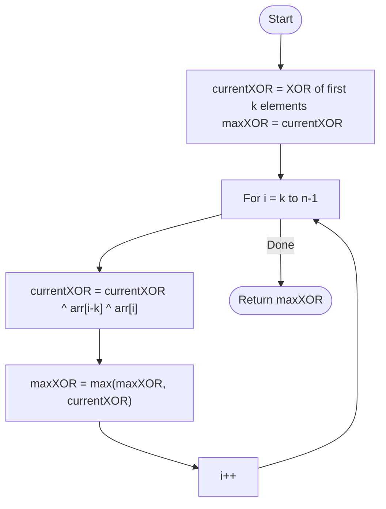

# 💡 Approach — Fixed Sliding Window (XOR)

| 📄 [Problem](./Problem.md) | 💡 [Approach](./Approach.md) | 🧩 [Solution](./Solution.cpp) | 🚀 [Main](./Main.cpp) |
|:--------------------------:|:-----------------------------:|:------------------------------:|:---------------------:|

---

## 📊 Metadata

---

> [!TIP]
> **Core Insight:** Unlike sums, XOR is its own inverse ($A \oplus A = 0$). This makes it perfect for a sliding window: to remove the contribution of an element exiting the window, simply XOR it again. This allows $O(1)$ window updates.

---

## 🔩 Step-by-Step Breakdown
1. **Initialize Window:**
   - Calculate the XOR of the first `k` elements: `currentXOR = arr[0] ^ arr[1] ^ ... ^ arr[k-1]`.
   - Set `maxXOR = currentXOR`.
2. **Slide the Window:**
   - Iterate from index `i = k` to `n-1`.
   - The element exiting the window is `arr[i - k]`.
   - The element entering the window is `arr[i]`.
   - Update XOR: `currentXOR = currentXOR ^ arr[i - k] ^ arr[i]`.
3. **Update Max:**
   - At each step, update `maxXOR = max(maxXOR, currentXOR)`.
4. **Return Result:** The `maxXOR` found.

---

## 🔄 Mermaid Flowchart

---

## 📊 Complexity Analysis
| Type | Complexity |
| :--- | :--- |
| **Time Complexity** | $O(N)$ - Single pass to calculate initial XOR and slide the window. |
| **Space Complexity** | $O(1)$ - Only constant extra variables used. |

---

> *"In the binary world, adding and removing are the same motion: a simple flip of the bit."*

---

<h3>Happy Coding! 🚀</h3>

