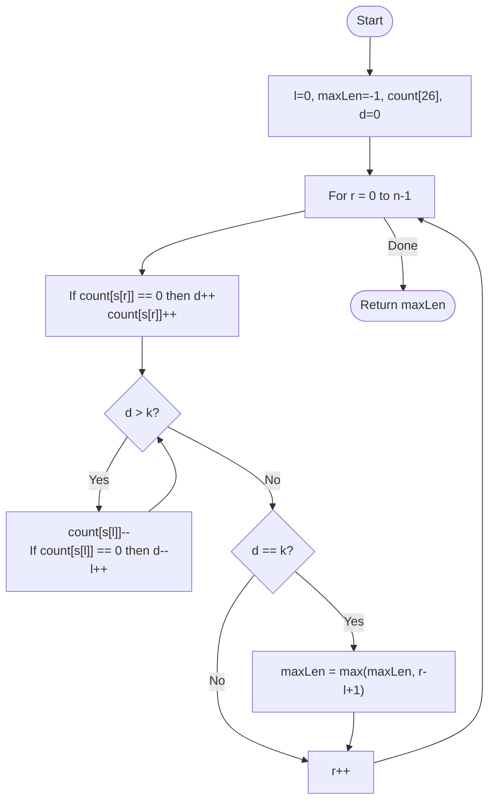

# 💡 Approach — Sliding Window (Fixed Diversity)

| 📄 [Problem](./Problem.md) | 💡 [Approach](./Approach.md) | 🧩 [Solution](./Solution.cpp) | 🚀 [Main](./Main.cpp) |
|:--------------------------:|:-----------------------------:|:------------------------------:|:---------------------:|

---

## 📊 Metadata

---

> [!TIP]
> **Core Insight:** To maintain exactly $K$ distinct characters, we use a sliding window with a frequency tracker. If the diversity exceeds $K$, we contract the left edge. The maximum window size observed while diversity is exactly $K$ gives our result.

---

## 🔩 Step-by-Step Breakdown
1. **Initialize:** 
   - `left = 0`, `maxLen = -1`, `distinctCount = 0`.
   - Frequency array `count[26]` for lowercase English letters.
2. **Expand Right Boundary:**
   - Iterate with `right` from $0$ to $n-1$.
   - For each character `s[right]`:
     - If `count[s[right]] == 0`, increment `distinctCount`.
     - `count[s[right]]++`.
3. **Contract Left Boundary:**
   - If `distinctCount > k`:
     - While `distinctCount > k`:
       - `count[s[left]]--`.
       - If `count[s[left]] == 0`, decrement `distinctCount`.
       - `left++`.
4. **Evaluate:**
   - If `distinctCount == k`, update `maxLen = max(maxLen, right - left + 1)`.
5. **Return:** The `maxLen` found (initial `-1` covers "not found" cases).

---

## 🔄 Mermaid Flowchart

---

## 📊 Complexity Analysis
| Type | Complexity |
| :--- | :--- |
| **Time Complexity** | $O(N)$ - Each character is processed at most twice (once by `right`, once by `left`). |
| **Space Complexity** | $O(1)$ - Frequency array of size 26 is constant space. |

---

> *"The length of the journey is dictated by the variety of stops we allow along the way."*

---

<h3>Happy Coding! 🚀</h3>

