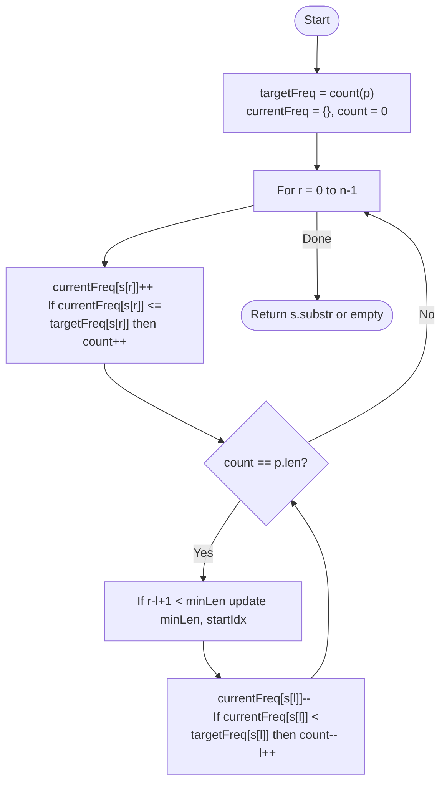

# 💡 Approach — Sliding Window (Minimum Substring)

| 📄 [Problem](./Problem.md) | 💡 [Approach](./Approach.md) | 🧩 [Solution](./Solution.cpp) | 🚀 [Main](./Main.cpp) |
|:--------------------------:|:-----------------------------:|:------------------------------:|:---------------------:|

---

## 📊 Metadata

---

> [!TIP]
> **Core Insight:** To find the smallest window, we first expand the window to find a valid one, then greedily shrink it from the left while maintaining the "validity" (containing all characters of $P$). This "expand-then-shrink" strategy ensures we find the global minimum in linear time.

---

## 🔩 Step-by-Step Breakdown
1. **Frequency Mapping:**
   - Precompute frequencies of all characters in `p` into `targetFreq[256]`.
   - Use `currentFreq[256]` to track characters in the current sliding window.
2. **Expand Window:**
   - Iterate with `right` through string `s`.
   - Update `currentFreq[s[right]]`. If this character helps satisfy a requirement in `p`, increment a `matchCount`.
3. **Shrink Window:**
   - Once `matchCount == p.length()` (window is valid):
     - Check if the current window `[left, right]` is smaller than the recorded `minLen`. Update if so.
     - Try to remove `s[left]` from the window.
     - If removing `s[left]` makes the window invalid (it was a required character), decrement `matchCount`.
     - Increment `left`.
4. **Result:** Extract the substring using the recorded `startIndex` and `minLen`.

---

## 🔄 Mermaid Flowchart

---

## 📊 Complexity Analysis
| Type | Complexity |
| :--- | :--- |
| **Time Complexity** | $O(N)$ - Each character in `s` is visited twice at most. |
| **Space Complexity** | $O(1)$ - Fixed-size frequency arrays (ASCII 256). |

---

> *"The essence of a search is to cast a wide net and then tighten the strings until only the vital remains."*

---

<h3>Happy Coding! 🚀</h3>

