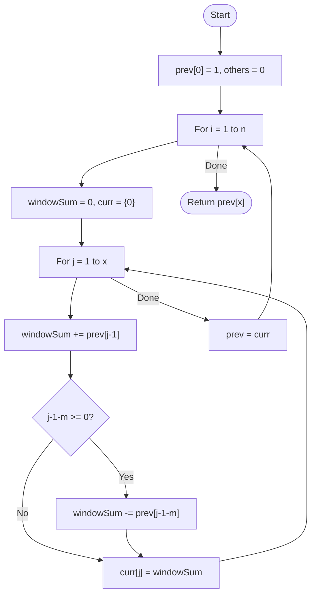

# 💡 Approach — DP with Sliding Window Sum

| 📄 [Problem](./Problem.md) | 💡 [Approach](./Approach.md) | 🧩 [Solution](./Solution.cpp) | 🚀 [Main](./Main.cpp) |
|:--------------------------:|:-----------------------------:|:------------------------------:|:---------------------:|

---

## 📊 Metadata

---

> [!TIP]
> **Core Insight:** A standard DP approach takes $O(N \cdot X \cdot M)$. However, by observing that each state is a sum of a sliding window from the previous row, we can optimize the transition to $O(1)$ using a running `windowSum`. This reduces the total complexity to $O(N \cdot X)$.

---

## 🔩 Step-by-Step Breakdown
1. **DP State:**
   - Let `dp[i][j]` be the number of ways to get sum `j` using `i` dice.
   - We only need the previous dice's results, so we use two rows: `prev` and `curr`.
2. **Base Case:**
   - `prev[0] = 1`. (1 way to get sum 0 with 0 dice).
3. **Transition with Sliding Window:**
   - For each die `i` from $1$ to $n$:
     - Maintain a `windowSum`.
     - For each target sum `j` from $1$ to $x$:
       - `windowSum += prev[j-1]` (Add the newest possible state from the previous roll).
       - If `j - 1 - m >= 0`, `windowSum -= prev[j - 1 - m]` (Remove the state that is now too far away).
       - `curr[j] = windowSum`.
4. **Update:** `prev = curr`.
5. **Return:** `prev[x]`.

---

## 🔄 Mermaid Flowchart

---

## 📊 Complexity Analysis
| Type | Complexity |
| :--- | :--- |
| **Time Complexity** | $O(N \cdot X)$ - With window sum optimization, transition is $O(1)$. |
| **Space Complexity** | $O(X)$ - Only storing two 1D rows for DP states. |

---

> *"Probability is the architecture of chance, and DP is the blueprint for counting its pathways."*

---

<h3>Happy Coding! 🚀</h3>

