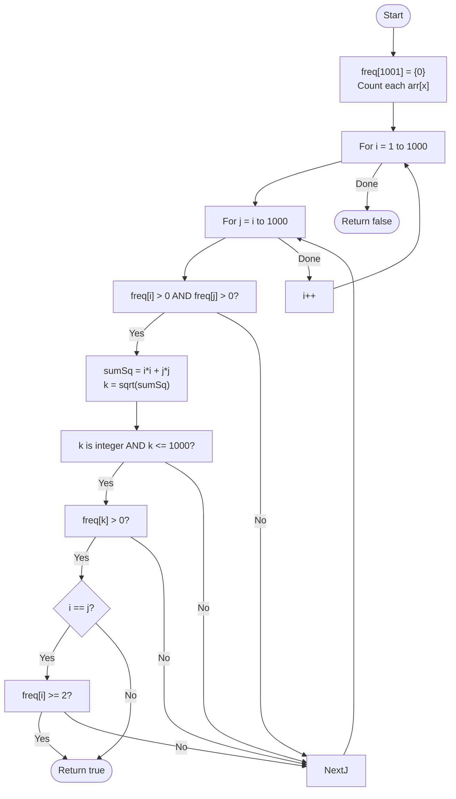

# 💡 Approach — Frequency Array Optimization ($O(V^2)$)

| 📄 [Problem](./Problem.md) | 💡 [Approach](./Approach.md) | 🧩 [Solution](./Solution.cpp) | 🚀 [Main](./Main.cpp) |
|:--------------------------:|:-----------------------------:|:------------------------------:|:---------------------:|

---

## 📊 Metadata

---

> [!TIP]
> **Core Insight:** While $N$ can be as large as $10^5$, the element values are limited to $1000$. By using a frequency array of size $1001$, we can check all possible pairs of *values* instead of *indices*. This reduces the complexity from $O(N^2)$ to $O(V^2)$, where $V$ is the maximum value in the array.

---

## 🔩 Step-by-Step Breakdown
1. **Count Frequencies:**
   - Create a frequency array `freq[1001]` and count occurrences of each element in `arr`.
2. **Iterate Values:**
   - Use two nested loops to pick two values $i$ and $j$ from $1$ to $1000$.
   - **Condition Check:**
     - If `freq[i] > 0` and `freq[j] > 0`:
       - Calculate `sumSq = i*i + j*j`.
       - Check if `sqrt(sumSq)` is an integer $k$.
       - If $k \le 1000$ and `freq[k] > 0`:
         - Ensure distinct indices:
           - If $i == j$, we need `freq[i] >= 2`.
           - If $i == k$ or $j == k$, we need appropriate counts. (Usually $k > i$ and $k > j$ for triplets, so this is rarely an issue unless elements are 0).
3. **Return:** `true` if any triplet is found, else `false`.

---

## 🔄 Mermaid Flowchart

---

## 📊 Complexity Analysis
| Type | Complexity |
| :--- | :--- |
| **Time Complexity** | $O(N + V^2)$ - $O(N)$ to fill frequencies, $O(V^2)$ to check pairs. |
| **Space Complexity** | $O(V)$ - Frequency array of size 1001. |

---

> *"Constraints are not walls, but guides to a more efficient path."*

---

<h3>Happy Coding! 🚀</h3>

