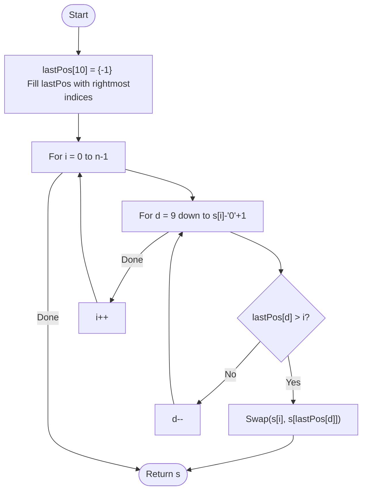

# 💡 Approach — Greedy Rightmost Digit Tracking

| 📄 [Problem](./Problem.md) | 💡 [Approach](./Approach.md) | 🧩 [Solution](./Solution.cpp) | 🚀 [Main](./Main.cpp) |
|:--------------------------:|:-----------------------------:|:------------------------------:|:---------------------:|

---

## 📊 Metadata

---

> [!TIP]
> **Core Insight:** To maximize the lexicographical value, we should replace the earliest possible digit with the largest available digit from its right. If multiple instances of the same maximum digit exist, picking the rightmost one is crucial to keep the smaller digit at a lower significance position.

---

## 🔩 Step-by-Step Breakdown
1. **Rightmost Index Mapping:**
   - Create an array `lastPos[10]` to store the rightmost occurrence of each digit (0-9).
   - Traverse the string once to fill this array.
2. **Identify Optimal Swap:**
   - Traverse the string from left to right (index `i`).
   - For each digit `s[i]`:
     - Scan digits from 9 down to `s[i] + 1`.
     - Check if any such higher digit exists at an index `j > i` (using `lastPos`).
     - The first (highest) such digit we find is our best candidate.
3. **Execute and Break:**
   - Perform the swap `s[i]` with `s[lastPos[highDigit]]`.
   - Since only one swap is allowed, terminate immediately after the first successful swap.
4. **Return:** The modified (or original) string.

---

## 🔄 Mermaid Flowchart

---

## 📊 Complexity Analysis
| Type | Complexity |
| :--- | :--- |
| **Time Complexity** | $O(N)$ - One pass for `lastPos`, another pass for finding the swap (inner loop is $O(10)$). |
| **Space Complexity** | $O(1)$ - Fixed-size array for digits 0-9. |

---

> *"Greatness is achieved by moving the right pieces at the right time."*

---

<h3>Happy Coding! 🚀</h3>

