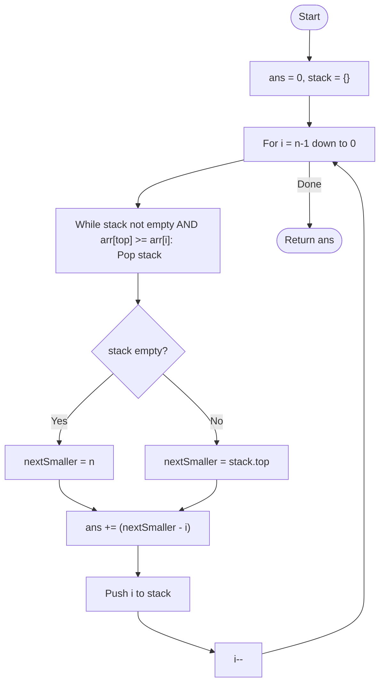

# 💡 Approach — Monotonic Stack (Next Smaller Element)

| 📄 [Problem](./Problem.md) | 💡 [Approach](./Approach.md) | 🧩 [Solution](./Solution.cpp) | 🚀 [Main](./Main.cpp) |
|:--------------------------:|:-----------------------------:|:------------------------------:|:---------------------:|

---

## 📊 Metadata

---

> [!TIP]
> **Core Insight:** A subarray starting at index $i$ is valid only if every subsequent element is $\ge arr[i]$. The first element smaller than $arr[i]$ to its right acts as a "hard boundary." Therefore, the count of such subarrays is exactly the distance to the **Next Smaller Element**.

---

## 🔩 Step-by-Step Breakdown
1. **The Goal:** For every index $i$, find the first index $j > i$ such that $arr[j] < arr[i]$.
2. **Reverse Traversal:**
   - Iterate through the array from $n-1$ down to $0$.
3. **Maintain Monotonicity:**
   - Use a stack to store indices of elements encountered so far.
   - For current element `arr[i]`:
     - Pop indices from the stack as long as the elements at those indices are $\ge arr[i]$.
4. **Identify Boundary:**
   - If the stack is empty after popping, the "Next Smaller" is effectively at index $n$.
   - Otherwise, the top of the stack is the index of the Next Smaller Element.
5. **Count Subarrays:**
   - Number of valid subarrays starting at $i$ is `nextSmallerIndex - i`.
   - Accumulate this into the total answer.
6. **Update Stack:** Push current index $i$ onto the stack.

---

## 🔄 Mermaid Flowchart

---

## 📊 Complexity Analysis
| Type | Complexity |
| :--- | :--- |
| **Time Complexity** | $O(N)$ - Each element is pushed and popped exactly once. |
| **Space Complexity** | $O(N)$ - In the worst case, the stack stores all $N$ indices. |

---

> *"The first crack in a foundation determines the limit of the structure above it."*

---

<h3>Happy Coding! 🚀</h3>

