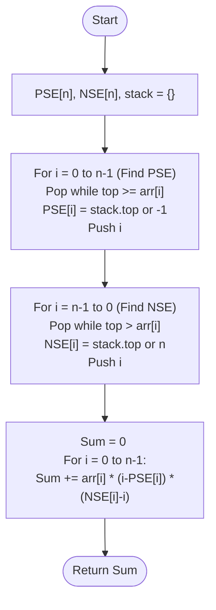

# 💡 Approach — Monotonic Stack (Contribution Counting)

| 📄 [Problem](./Problem.md) | 💡 [Approach](./Approach.md) | 🧩 [Solution](./Solution.cpp) | 🚀 [Main](./Main.cpp) |
|:--------------------------:|:-----------------------------:|:------------------------------:|:---------------------:|

---

## 📊 Metadata

---

> [!TIP]
> **Core Insight:** Instead of finding the minimum for every subarray, we calculate how many subarrays each element $arr[i]$ contributes to as a minimum. By identifying the **Previous Smaller** and **Next Smaller** boundaries, we can determine the exact count of subarrays using basic combinatorics.

---

## 🔩 Step-by-Step Breakdown
1. **The Goal:** For each element $arr[i]$, find the range $[L, R]$ where $arr[i]$ is the absolute minimum.
2. **Previous Smaller Element (PSE):**
   - For index $i$, find the nearest index $L < i$ such that $arr[L] < arr[i]$.
   - If no such element exists, $L = -1$.
3. **Next Smaller Element (NSE):**
   - For index $i$, find the nearest index $R > i$ such that $arr[R] \le arr[i]$.
   - Note: Using $\le$ on one side and $<$ on the other avoids overcounting when duplicate elements exist.
4. **Contribution Formula:**
   - The number of subarrays where $arr[i]$ is the minimum is $(i - L) \times (R - i)$.
   - Contribution to total sum = $arr[i] \times (i - L) \times (R - i)$.
5. **Monotonic Stack implementation:**
   - Use two passes (or one combined pass) with a monotonic stack to find PSE and NSE in $O(N)$ time.

---

## 🔄 Mermaid Flowchart

---

## 📊 Complexity Analysis
| Type | Complexity |
| :--- | :--- |
| **Time Complexity** | $O(N)$ - Two linear passes through the array using a monotonic stack. |
| **Space Complexity** | $O(N)$ - Storing PSE, NSE, and stack indices. |

---

> *"The power of an element is defined not just by itself, but by the extent of its influence over its neighbors."*

---

<h3>Happy Coding! 🚀</h3>

