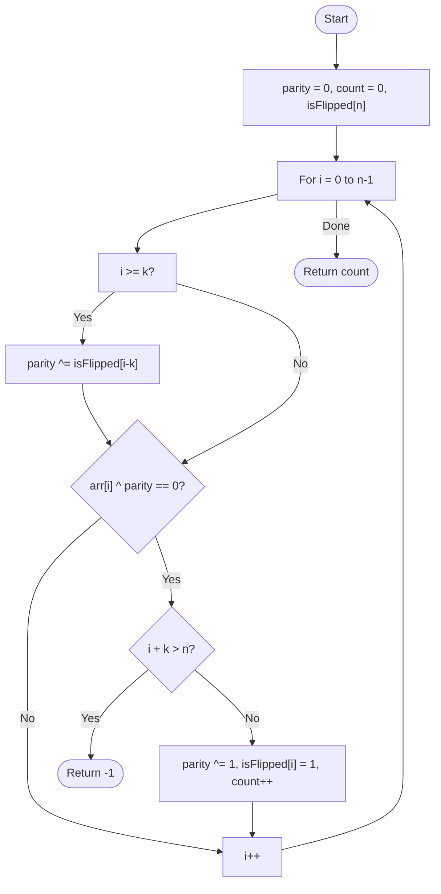

# 💡 Approach — Greedy with Flip Tracking

| 📄 [Problem](./Problem.md) | 💡 [Approach](./Approach.md) | 🧩 [Solution](./Solution.cpp) | 🚀 [Main](./Main.cpp) |
|:--------------------------:|:-----------------------------:|:------------------------------:|:---------------------:|

---

## 📊 Metadata

---

> [!TIP]
> **Core Insight:** A naive flip approach takes $O(N \cdot K)$. However, since bit flips are binary ($X \oplus 1 \oplus 1 = X$), we can use a "current flip parity" variable to track how many active flips cover the current index. This allows us to determine if an element needs flipping in $O(1)$ and complete the task in $O(N)$.

---

## 🔩 Step-by-Step Breakdown
1. **The Greedy Logic:** 
   - Scan the array from left to right.
   - If we encounter an element that is effectively 0, we **must** flip the subarray of length $K$ starting at that index. This is the only way to make that specific index a 1 without affecting indices to its left.
2. **Efficient Flip Tracking:**
   - Instead of actually flipping $K$ elements (which is slow), use a `parity` variable to track the number of active flips.
   - Use an auxiliary array `isFlipped[n]` to mark where each flip begins.
3. **Sliding the Parity:**
   - At index $i$, if $i \ge K$, check if a flip started at $i-K$. If so, its influence ends here; toggle `parity`.
   - The current value of `arr[i]` is effectively `arr[i] ^ parity`.
   - If `arr[i] ^ parity == 0`:
     - If $i + K > n$, we can't perform a full flip; return -1.
     - Else, start a flip at $i$: toggle `parity`, mark `isFlipped[i] = 1`, and increment result count.
4. **Result:** The total count of flips performed.

---

## 🔄 Mermaid Flowchart

---

## 📊 Complexity Analysis
| Type | Complexity |
| :--- | :--- |
| **Time Complexity** | $O(N)$ - Single pass through the array. |
| **Space Complexity** | $O(N)$ - Auxiliary array to track flip start indices. |

---

> *"Greed is good when it leaves no 0 behind."*

---

<h3>Happy Coding! 🚀</h3>

