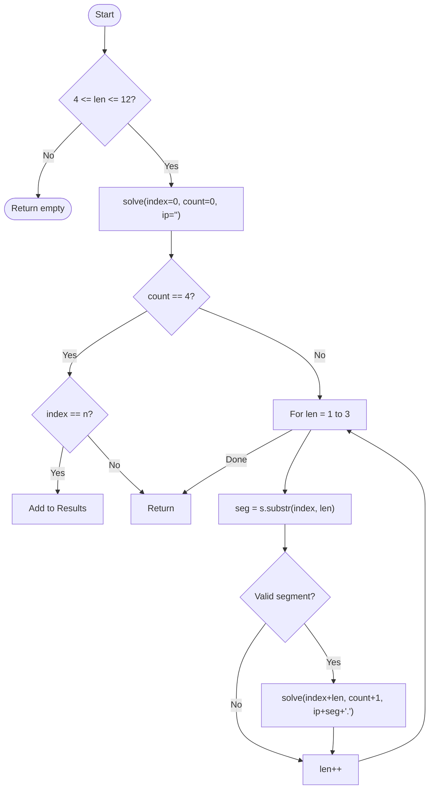

# 💡 Approach — Backtracking (IP Restoration)

| 📄 [Problem](./Problem.md) | 💡 [Approach](./Approach.md) | 🧩 [Solution](./Solution.cpp) | 🚀 [Main](./Main.cpp) |
|:--------------------------:|:-----------------------------:|:------------------------------:|:---------------------:|

---

## 📊 Metadata

---

> [!TIP]
> **Core Insight:** Restoring an IP address from a raw string is a problem of splitting the string into 4 valid numeric segments. Each segment must be between 0 and 255 and cannot have leading zeros unless it's exactly "0". Backtracking allows us to explore all possible split points efficiently.

---

## 🔩 Step-by-Step Breakdown
1. **Initial Filter:**
   - If the string length is less than 4 or greater than 12, it's impossible to form a valid IP. Return an empty list.
2. **Backtracking Function:**
   - `solve(index, partCount, currentIP)`:
     - **Base Case:** If `partCount == 4`:
       - If `index == n`, add `currentIP` (removing trailing dot) to results.
       - Return.
     - **Recursive Step:**
       - Try taking 1, 2, or 3 digits starting from `index`.
       - For each length $L \in \{1, 2, 3\}$:
         - Extract substring `seg`.
         - **Validate Segment:**
           - If `seg` starts with '0' and length > 1: Invalid (Leading zero).
           - Convert `seg` to integer. If value > 255: Invalid.
         - If valid, recurse: `solve(index + L, partCount + 1, currentIP + seg + ".")`.
3. **Result:** Collect all valid strings found in the recursion.

---

## 🔄 Mermaid Flowchart

---

## 📊 Complexity Analysis
| Type | Complexity |
| :--- | :--- |
| **Time Complexity** | $O(1)$ - The total number of valid IPs is small. Max states explored $\approx 3^4 = 81$. |
| **Space Complexity** | $O(1)$ - Recursion depth is capped at 4. |

---

> *"Identity is defined by where the dots are placed, not just the numbers themselves."*

---

<h3>Happy Coding! 🚀</h3>

