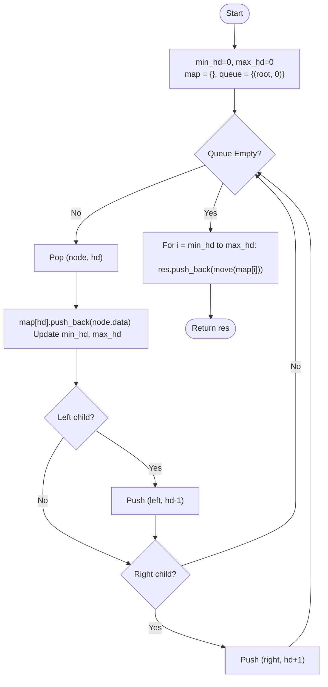

# 💡 Approach — BFS with Horizontal Distance Mapping

| 📄 [Problem](./Problem.md) | 💡 [Approach](./Approach.md) | 🧩 [Solution](./Solution.cpp) | 🚀 [Main](./Main.cpp) |
|:--------------------------:|:-----------------------------:|:------------------------------:|:---------------------:|

---

## 📊 Metadata

---

> [!TIP]
> **Core Insight:** Vertical traversal requires grouping nodes by their "horizontal distance" (HD) from the root. BFS is superior to DFS here because it naturally maintains the top-to-bottom order within each vertical line. By using an `unordered_map` and tracking the `min_hd` and `max_hd`, we can produce the result in linear $O(N)$ time without the $O(\log N)$ overhead of an ordered map.

---

## 🔩 Step-by-Step Breakdown
1. **Define Horizontal Distance (HD):**
   - Root is at $HD = 0$.
   - Left child of a node at $HD$ is at $HD - 1$.
   - Right child of a node at $HD$ is at $HD + 1$.
2. **BFS Traversal:**
   - Use a queue to store pairs of `(Node*, HD)`.
   - As we traverse, store the node's data in an `unordered_map<int, vector<int>>`.
   - Update `min_hd` and `max_hd` to keep track of the range of vertical lines.
3. **Ordering Results:**
   - BFS ensures that nodes at the same HD are processed in level-order (top to bottom).
   - After traversal, iterate from `min_hd` to `max_hd`.
   - Extract vectors from the map in order.
4. **Efficiency Note:** Use `std::move` when collecting results from the map to avoid expensive copies of large vectors.

---

## 🔄 Mermaid Flowchart

---

## 📊 Complexity Analysis
| Type | Complexity |
| :--- | :--- |
| **Time Complexity** | $O(N)$ - Single BFS pass and a linear scan of the HD range. |
| **Space Complexity** | $O(N)$ - Storing all nodes in the map and the queue. |

---

> *"The structure of a tree is best understood by looking at the shadows it casts across the horizontal plane."*

---

<h3>Happy Coding! 🚀</h3>

