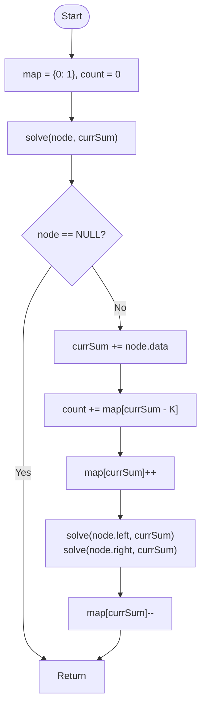

# 💡 Approach — DFS with Prefix Sum Hashing

| 📄 [Problem](./Problem.md) | 💡 [Approach](./Approach.md) | 🧩 [Solution](./Solution.cpp) | 🚀 [Main](./Main.cpp) |
|:--------------------------:|:-----------------------------:|:------------------------------:|:---------------------:|

---

## 📊 Metadata

---

> [!TIP]
> **Core Insight:** This problem is the tree equivalent of finding a subarray with sum $K$. By maintaining a hash map of prefix sums along the current path from the root, we can check in $O(1)$ how many subpaths ending at the current node sum to $K$. This reduces the complexity from $O(N^2)$ (checking all node pairs) to $O(N)$.

---

## 🔩 Step-by-Step Breakdown
1. **The Core Logic:**
   - As we traverse the tree from root to leaf, maintain a running `currSum`.
   - Any path segment ending at the current node that sums to $K$ must have started at a previous node where the prefix sum was `currSum - K`.
2. **Frequency Mapping:**
   - Use `unordered_map<long long, int>` to store the frequency of each prefix sum encountered on the current path.
   - Initialize `map[0] = 1` to account for paths starting exactly from the root.
3. **DFS Traversal:**
   - Update `currSum` with the current node's data.
   - Add `map[currSum - K]` to the total count.
   - Increment the frequency of `currSum` in the map.
4. **Backtracking (Crucial Step):**
   - After exploring left and right subtrees, decrement the frequency of `currSum` in the map.
   - This ensures that only prefix sums from the *current* path are considered, preventing nodes from parallel branches from interfering.

---

## 🔄 Mermaid Flowchart

---

## 📊 Complexity Analysis
| Type | Complexity |
| :--- | :--- |
| **Time Complexity** | $O(N)$ - Each node is visited exactly once. |
| **Space Complexity** | $O(H)$ - Recursion stack depth and map size are proportional to tree height. |

---

> *"A path is not just a destination, but a sequence of values that find their balance in $K$."*

---

<h3>Happy Coding! 🚀</h3>

