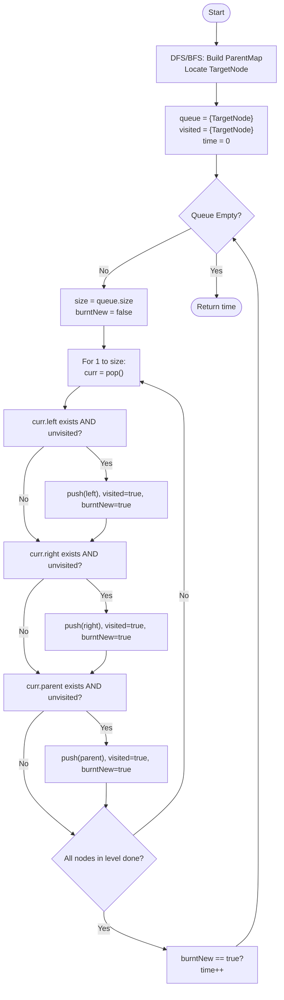

# 💡 Approach — BFS with Parent Mapping

| 📄 [Problem](./Problem.md) | 💡 [Approach](./Approach.md) | 🧩 [Solution](./Solution.cpp) | 🚀 [Main](./Main.cpp) |
|:--------------------------:|:-----------------------------:|:------------------------------:|:---------------------:|

---

## 📊 Metadata

---

> [!TIP]
> **Core Insight:** Fire spreading in a tree can be modeled as a Breadth-First Search (BFS) in an undirected graph. Since binary trees only provide child pointers, we must first build a "Parent Map" to allow fire to spread upwards to parents. The time required is simply the number of levels (BFS depth) from the target node to the furthest leaf.

---

## 🔩 Step-by-Step Breakdown
1. **Graph Construction (Parent Mapping):**
   - Traverse the tree (using BFS or DFS) to map every node to its parent.
   - While traversing, locate the `target` node.
2. **Burn Simulation (BFS):**
   - Use a queue for BFS, starting with the `target` node at time 0.
   - Use a `visited` set to prevent fire from re-burning nodes.
3. **Level-Order Expansion:**
   - At each second (level), process all nodes currently in the queue.
   - For each burning node, spread fire to its:
     - Left child
     - Right child
     - Parent (retrieved from the parent map)
   - If any new node is added to the queue, increment the `time` counter.
4. **Result:** The total time taken until the queue is empty.

---

## 🔄 Mermaid Flowchart

---

## 📊 Complexity Analysis
| Type | Complexity |
| :--- | :--- |
| **Time Complexity** | $O(N)$ - One pass to build parents, one pass for BFS. |
| **Space Complexity** | $O(N)$ - Parent map, visited set, and BFS queue. |

---

> *"Fire doesn't care about the hierarchy of the tree; it only sees the connections."*

---

<h3>Happy Coding! 🚀</h3>

