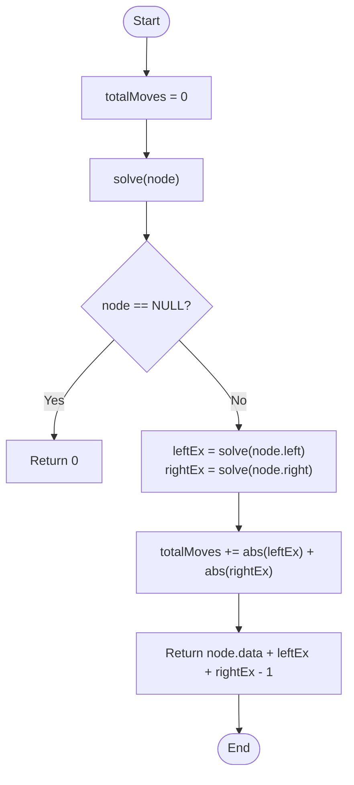

# 💡 Approach — Post-Order Traversal (Excess/Deficit Balancing)

| 📄 [Problem](./Problem.md) | 💡 [Approach](./Approach.md) | 🧩 [Solution](./Solution.cpp) | 🚀 [Main](./Main.cpp) |
|:--------------------------:|:-----------------------------:|:------------------------------:|:---------------------:|

---

## 📊 Metadata

---

> [!TIP]
> **Core Insight:** Every edge in the tree must transport the exact amount of "excess" or "deficit" candies required by the subtree below it to reach a state of 1 candy per node. By performing a post-order DFS, we can calculate the local balance of each subtree and sum the absolute values of these balances to find the minimum moves.

---

## 🔩 Step-by-Step Breakdown
1. **Define Balance:**
   - For any node $u$, let $B(u)$ be the number of candies it currently has.
   - For a subtree rooted at $u$, the total excess/deficit candies that *must* cross the edge $(u, \text{parent}(u))$ is:
     $Excess(u) = B(u) - 1 + Excess(\text{left}) + Excess(\text{right})$.
2. **Greedy Move Counting:**
   - Every candy moving through an edge counts as 1 move.
   - The total moves contributed by the edges to children of $u$ are $|Excess(\text{left})| + |Excess(\text{right})|$.
3. **Post-Order DFS:**
   - Recursively visit left and right children.
   - Calculate their excess.
   - Accumulate the absolute excess into a global `totalMoves` variable.
   - Return the current node's excess to its parent.
4. **Result:** The accumulated `totalMoves`.

---

## 🔄 Mermaid Flowchart

---

## 📊 Complexity Analysis
| Type | Complexity |
| :--- | :--- |
| **Time Complexity** | $O(N)$ - Each node is visited exactly once. |
| **Space Complexity** | $O(H)$ - Recursion stack depth is proportional to tree height. |

---

> *"Balance is not a static state, but the sum of all adjustments made along the way."*

---

<h3>Happy Coding! 🚀</h3>

