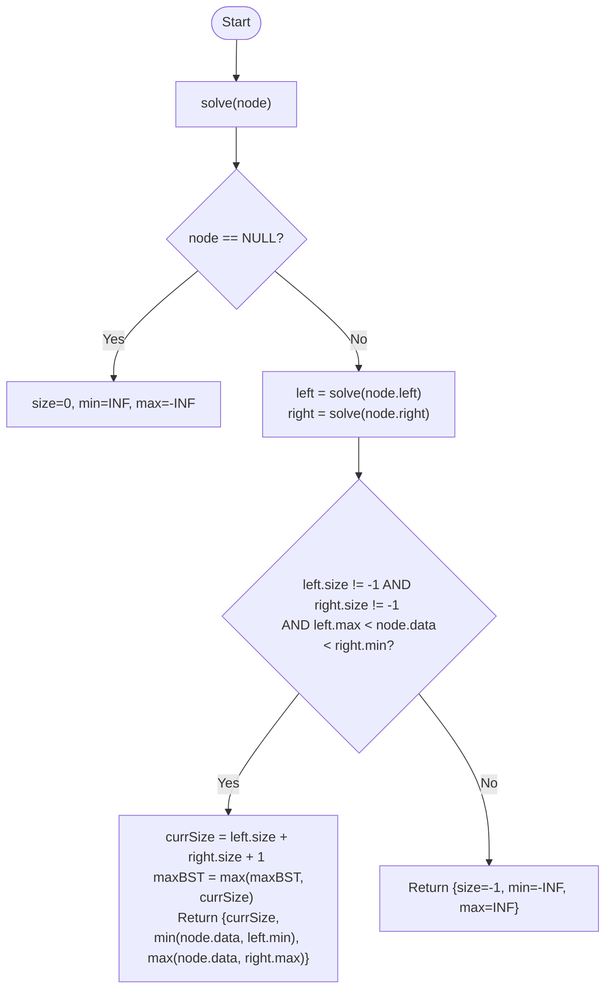

# 💡 Approach — Post-Order DFS (BST Property Validation)

| 📄 [Problem](./Problem.md) | 💡 [Approach](./Approach.md) | 🧩 [Solution](./Solution.cpp) | 🚀 [Main](./Main.cpp) |
|:--------------------------:|:-----------------------------:|:------------------------------:|:---------------------:|

---

## 📊 Metadata

---

> [!TIP]
> **Core Insight:** To identify the largest BST subtree, we must validate each node bottom-up. A node is part of a BST if its children are BST roots and its value is strictly between the maximum of the left subtree and the minimum of the right subtree. By returning min, max, and size in a single DFS pass, we achieve $O(N)$ time.

---

## 🔩 Step-by-Step Breakdown
1. **The Bottom-Up Strategy:**
   - A node $U$ is a BST root if:
     - Its left child $L$ is a BST root.
     - Its right child $R$ is a BST root.
     - $\max(L) < U.data < \min(R)$.
2. **Information Passing:**
   - Each recursive call returns a custom object or updates references for:
     - `minVal`: The minimum value in the subtree.
     - `maxVal`: The maximum value in the subtree.
     - `size`: The total number of nodes in the subtree.
     - `isBST`: A boolean flag (often represented by size = -1 if invalid).
3. **Recursive Logic:**
   - For a leaf node: return `{min: data, max: data, size: 1, isBST: true}`.
   - For an internal node:
     - If both children are BSTs and constraints are met:
       - `newSize = left.size + right.size + 1`.
       - Update global `maxBSTSize`.
       - Return `{min: min(data, left.min), max: max(data, right.max), size: newSize}`.
     - Else:
       - Return `{min: -INF, max: INF, size: -1, isBST: false}`.

---

## 🔄 Mermaid Flowchart

---

## 📊 Complexity Analysis
| Type | Complexity |
| :--- | :--- |
| **Time Complexity** | $O(N)$ - One post-order traversal visits every node once. |
| **Space Complexity** | $O(H)$ - Recursion stack depth equals tree height. |

---

> *"The strength of a tree is found at its roots, but its identity is validated leaf by leaf."*

---

<h3>Happy Coding! 🚀</h3>

